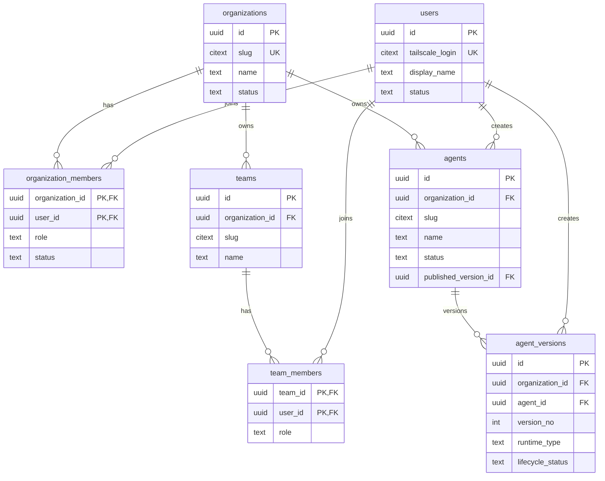
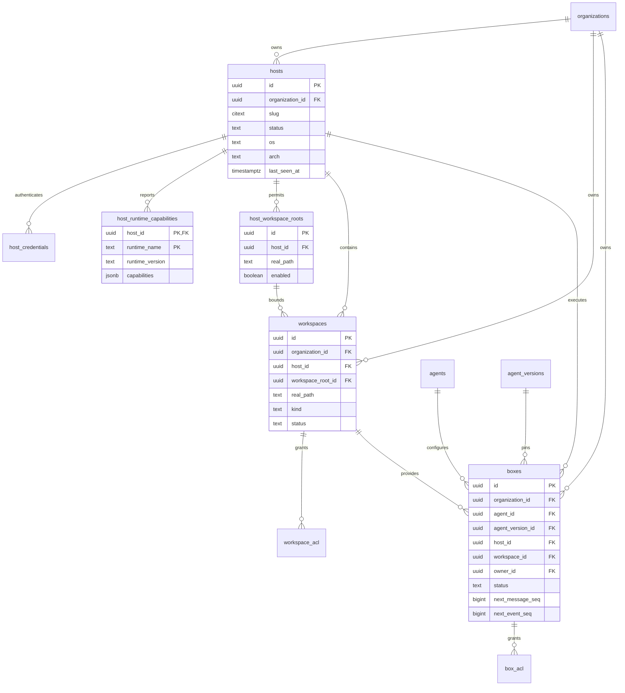
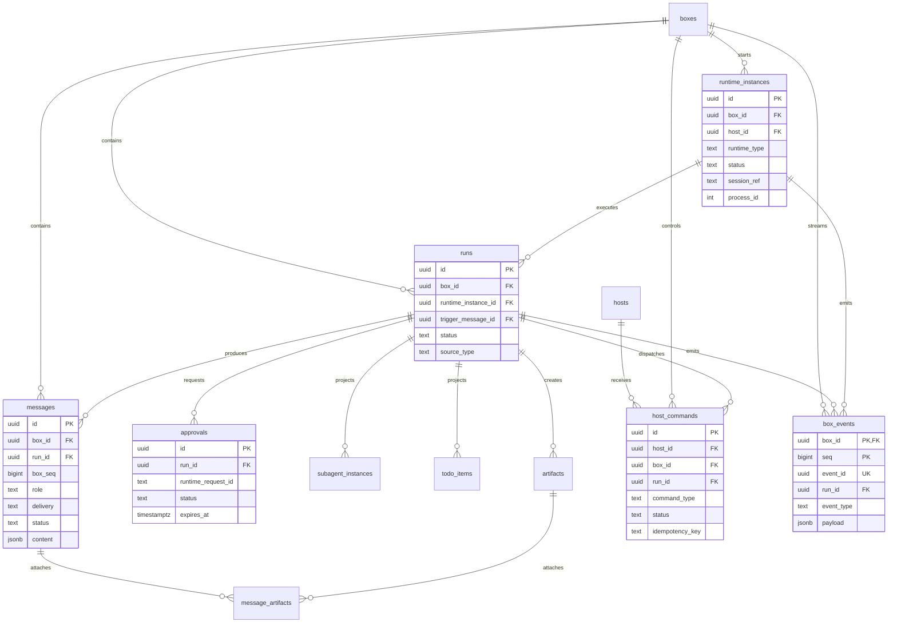
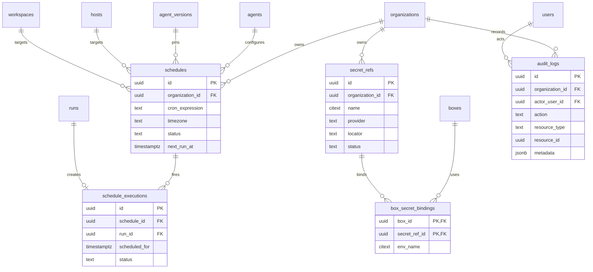

# Agent Box ERD 与数据库设计

- 状态：Development Ready
- 数据库：PostgreSQL 16+
- 上位设计：[`agent-box-technical-design.md`](./agent-box-technical-design.md)
- 覆盖范围：MVP 与 Multi-user V1 的持久化模型
- 权威实现：版本化 SQL Migration；本文是 Schema Contract，不允许 ORM 自动建表替代

## 1. 设计结论

数据库模型围绕六个边界组织：

1. Identity：Organization、User、Team、Membership。
2. Agent Configuration：Agent 与不可变 Agent Version。
3. Execution Topology：Host、Runtime Capability、Workspace。
4. Conversation Runtime：Box、Runtime Instance、Run、Message。
5. Reliable Control：Host Command、Event、Approval、Subagent/Todo Projection。
6. Automation and Governance：Artifact、Schedule、Secret Reference、Audit Log。

关键不变量：

- 所有租户资源必须带 `organization_id`。
- Agent Version 发布后不可修改；Box 固定引用具体 Version。
- Workspace 固定属于一个 Host；MVP 不支持 Box 运行中迁移 Host。
- 单个 Box 同一时刻最多一个活跃 Main Run。
- 单个 Box 同一时刻最多一个活跃 Runtime Instance。
- 用户写命令必须携带 Idempotency Key。
- Runtime Event 至少一次传输，Server 通过 `daemon_event_id` 去重。
- Box Event 使用 `(box_id, seq)` 形成连续、可回放的权威事件流。
- Event 必须先提交 PostgreSQL，再广播 SSE。
- Approval 只能从 `pending` 原子转换一次。
- Audit Log 追加写，不允许业务 API 修改。
- Secret 原值不进入普通业务表、Event、Audit 或日志。

## 2. 已冻结的开发默认值

为避免实现阶段反复等待产品决策，ERD 按以下默认值开发；后续可以通过配置调整，不改变核心表关系。

| 决策 | 默认值 |
|---|---|
| 主键 | UUIDv7，由应用生成 |
| 时间 | `TIMESTAMPTZ`，统一 UTC |
| 命名 | PostgreSQL `snake_case`；API 使用 camelCase |
| 状态字段 | `TEXT + CHECK`，不使用 PostgreSQL ENUM |
| 乐观锁 | 关键聚合使用 `version BIGINT` |
| 多租户 | 应用 RBAC + 复合租户外键；MVP 不启用 PostgreSQL RLS |
| Agent Version | 发布后不可变，修改产生新版本 |
| Workspace | 同时支持 `existing` 和 `managed`，MVP 优先 existing |
| Box 分享 | 默认 private，通过显式 User/Team ACL 分享 |
| Runtime 空闲 TTL | Box 默认 30 分钟，可按 Agent/Box 覆盖 |
| 活跃 Run | 每个 Box 最多 1 个 |
| 活跃 Runtime | 每个 Box 最多 1 个 |
| Event 保留 | 默认 90 天；Audit 默认 365 天，均可配置 |
| Secret MVP | `host_env` 引用；Server 不保存原值 |
| 删除 | 业务资源软删除/终止；Event/Audit 由 Retention Job 清理 |
| Runtime | Schema 同时支持 OMP、Claude、ACP；实现可分阶段上线 |

## 3. PostgreSQL 约定

### 3.1 Extension

```sql
CREATE EXTENSION IF NOT EXISTS citext;
```

不依赖数据库生成 UUID；Go 服务统一生成 UUIDv7，保证跨服务唯一并改善索引局部性。

### 3.2 公共字段

可变业务实体通常包含：

```text
id             UUID PRIMARY KEY
organization_id UUID NOT NULL
version        BIGINT NOT NULL DEFAULT 1
created_at     TIMESTAMPTZ NOT NULL DEFAULT now()
updated_at     TIMESTAMPTZ NOT NULL DEFAULT now()
```

`updated_at` 由 Repository 显式更新，不依赖全局 Trigger，避免批量迁移和测试产生隐式行为。

### 3.3 租户外键

所有租户实体增加：

```sql
UNIQUE (organization_id, id)
```

子实体优先使用复合外键：

```sql
FOREIGN KEY (organization_id, box_id)
  REFERENCES boxes (organization_id, id)
```

避免应用 Bug 把 Organization A 的 Run 关联到 Organization B 的 Box。

### 3.4 状态字段

使用 `TEXT + CHECK`，而不是 PostgreSQL ENUM：

```sql
status TEXT NOT NULL CHECK (status IN ('active', 'archived'))
```

原因：Agent Runtime 和状态机会迭代；TEXT CHECK 的 Migration 和回滚更直接。

### 3.5 JSONB 使用边界

JSONB 只用于以下稳定边界：

- Runtime/Tool/Skill 配置 Snapshot。
- Runtime Event Payload。
- 脱敏 Approval Payload。
- Host labels/capabilities。
- Artifact metadata。

用户、权限、状态、关系、队列顺序、外键和查询条件必须关系化，禁止把核心模型塞入一个 JSONB 文档。

### 3.6 Foreign Key 删除策略

所有 Foreign Key 默认使用 PostgreSQL `ON DELETE NO ACTION`。领域对象采用软删除/状态终止，禁止实现者为方便清理而添加级联删除。唯一例外必须在 Migration 与本文中逐项说明，并提供数据影响评估。

## 4. ERD 总览

### 4.1 Identity 与 Agent Configuration



### 4.2 Host、Workspace 与 Box



### 4.3 Runtime、Run 与 Reliable Control



### 4.4 Automation 与 Governance



## 5. Identity Schema

### 5.1 `organizations`

| Column | Type | Null | Default | Constraint / Meaning |
|---|---|---:|---|---|
| id | UUID | No | app UUIDv7 | PK |
| slug | CITEXT | No | — | 全局唯一稳定标识 |
| name | TEXT | No | — | 展示名 |
| status | TEXT | No | `active` | `active/suspended/deleted` |
| version | BIGINT | No | 1 | 乐观锁 |
| created_at | TIMESTAMPTZ | No | now() | — |
| updated_at | TIMESTAMPTZ | No | now() | — |
| deleted_at | TIMESTAMPTZ | Yes | — | 软删除时间 |

约束与索引：

```sql
UNIQUE (slug)
CHECK (status IN ('active', 'suspended', 'deleted'))
CREATE INDEX organizations_status_idx ON organizations(status);
```

### 5.2 `users`

User 是跨 Organization 的全局身份，MVP 使用 Tailscale Login 映射。

| Column | Type | Null | Default | Constraint / Meaning |
|---|---|---:|---|---|
| id | UUID | No | app UUIDv7 | PK |
| tailscale_login | CITEXT | No | — | 全局唯一 |
| display_name | TEXT | No | — | — |
| avatar_url | TEXT | Yes | — | — |
| status | TEXT | No | `active` | `active/disabled` |
| last_seen_at | TIMESTAMPTZ | Yes | — | — |
| created_at | TIMESTAMPTZ | No | now() | — |
| updated_at | TIMESTAMPTZ | No | now() | — |

```sql
UNIQUE (tailscale_login)
CHECK (status IN ('active', 'disabled'))
```

### 5.3 `organization_members`

| Column | Type | Null | Meaning |
|---|---|---:|---|
| organization_id | UUID | No | PK/FK organizations |
| user_id | UUID | No | PK/FK users |
| role | TEXT | No | `owner/admin/operator/viewer` |
| status | TEXT | No | `active/suspended` |
| joined_at | TIMESTAMPTZ | No | default now() |
| invited_by_user_id | UUID | Yes | FK users |

```sql
PRIMARY KEY (organization_id, user_id)
CHECK (role IN ('owner', 'admin', 'operator', 'viewer'))
CHECK (status IN ('active', 'suspended'))
CREATE INDEX organization_members_user_idx ON organization_members(user_id, status);
```

至少一个 Owner 是应用层不变量；删除/降级最后一个 Owner 必须在事务中拒绝。

### 5.4 `teams`

| Column | Type | Null | Meaning |
|---|---|---:|---|
| id | UUID | No | PK |
| organization_id | UUID | No | FK organizations |
| slug | CITEXT | No | Organization 内唯一 |
| name | TEXT | No | — |
| description | TEXT | Yes | — |
| created_by_user_id | UUID | No | 必须是 Org Member |
| version | BIGINT | No | default 1 |
| created_at | TIMESTAMPTZ | No | — |
| updated_at | TIMESTAMPTZ | No | — |
| deleted_at | TIMESTAMPTZ | Yes | — |

```sql
UNIQUE (organization_id, id)
UNIQUE (organization_id, slug)
FOREIGN KEY (organization_id, created_by_user_id)
  REFERENCES organization_members(organization_id, user_id)
```

### 5.5 `team_members`

| Column | Type | Null | Meaning |
|---|---|---:|---|
| organization_id | UUID | No | 租户键 |
| team_id | UUID | No | PK/FK teams |
| user_id | UUID | No | PK；复合 FK organization_members |
| role | TEXT | No | `maintainer/member` |
| joined_at | TIMESTAMPTZ | No | — |

```sql
PRIMARY KEY (team_id, user_id)
FOREIGN KEY (organization_id, team_id) REFERENCES teams(organization_id, id)
FOREIGN KEY (organization_id, user_id) REFERENCES organization_members(organization_id, user_id)
CHECK (role IN ('maintainer', 'member'))
```

## 6. Agent Configuration Schema

### 6.1 `agents`

Agent 是逻辑身份；可执行配置位于不可变的 Agent Version。

| Column | Type | Null | Default | Meaning |
|---|---|---:|---|---|
| id | UUID | No | app UUIDv7 | PK |
| organization_id | UUID | No | — | FK organizations |
| slug | CITEXT | No | — | Org 内唯一 |
| name | TEXT | No | — | — |
| description | TEXT | Yes | — | — |
| status | TEXT | No | `active` | `active/archived` |
| published_version_id | UUID | Yes | — | 当前默认版本；迁移后增加 FK |
| created_by_user_id | UUID | No | — | Org Member |
| version | BIGINT | No | 1 | 乐观锁 |
| created_at | TIMESTAMPTZ | No | now() | — |
| updated_at | TIMESTAMPTZ | No | now() | — |
| archived_at | TIMESTAMPTZ | Yes | — | — |

```sql
UNIQUE (organization_id, id)
UNIQUE (organization_id, slug)
FOREIGN KEY (organization_id, created_by_user_id)
  REFERENCES organization_members(organization_id, user_id)
CHECK (status IN ('active', 'archived'))
```

### 6.2 `agent_versions`

发布后不可 UPDATE；需要修改时创建新 Version。

| Column | Type | Null | Meaning |
|---|---|---:|---|
| id | UUID | No | PK |
| organization_id | UUID | No | 租户键 |
| agent_id | UUID | No | FK agents |
| version_no | INTEGER | No | 从 1 递增 |
| lifecycle_status | TEXT | No | `draft/published/retired` |
| runtime_type | TEXT | No | `omp/claude/acp` |
| model | TEXT | Yes | Runtime 模型标识 |
| thinking_level | TEXT | Yes | Runtime 原生值 |
| prompt_mode | TEXT | No | `append/replace` |
| system_prompt | TEXT | No | Prompt Snapshot 来源 |
| tool_policy | JSONB | No | default `{}` |
| skill_policy | JSONB | No | default `{}` |
| approval_policy | JSONB | No | default `{}` |
| runtime_config | JSONB | No | default `{}` |
| idle_timeout_seconds | INTEGER | No | default 1800 |
| created_by_user_id | UUID | No | Org Member |
| created_at | TIMESTAMPTZ | No | — |
| published_at | TIMESTAMPTZ | Yes | — |

```sql
UNIQUE (organization_id, id)
UNIQUE (agent_id, version_no)
UNIQUE (agent_id, id)
UNIQUE (organization_id, agent_id, id)
FOREIGN KEY (organization_id, agent_id) REFERENCES agents(organization_id, id)
FOREIGN KEY (organization_id, created_by_user_id)
  REFERENCES organization_members(organization_id, user_id)
CHECK (lifecycle_status IN ('draft', 'published', 'retired'))
CHECK (runtime_type IN ('omp', 'claude', 'acp'))
CHECK (prompt_mode IN ('append', 'replace'))
CHECK (idle_timeout_seconds BETWEEN 60 AND 604800)
```

`agents.published_version_id` 在 `agent_versions` 创建后增加复合外键，保证 Published Version 确实属于该 Agent：

```sql
ALTER TABLE agents
ADD CONSTRAINT agents_published_version_fk
FOREIGN KEY (id, published_version_id)
REFERENCES agent_versions(agent_id, id);
```

发布事务：

1. 锁定 `agents` 行。
2. 验证 Version 属于 Agent 且状态是 draft。
3. 将目标 Version 更新为 published、写 `published_at`。
4. 将原 published Version 更新为 retired。
5. 更新 `agents.published_version_id` 和 `version + 1`。
6. 写 Audit Log。

数据库只允许每个 Agent 一个 published Version：

```sql
CREATE UNIQUE INDEX agent_versions_one_published_idx
ON agent_versions(agent_id)
WHERE lifecycle_status = 'published';
```

## 7. Execution Host Schema

### 7.1 `hosts`

| Column | Type | Null | Meaning |
|---|---|---:|---|
| id | UUID | No | PK |
| organization_id | UUID | No | FK organizations |
| slug | CITEXT | No | Org 内唯一 |
| name | TEXT | No | — |
| status | TEXT | No | `enrolling/online/draining/offline/revoked` |
| os | TEXT | Yes | daemon 首次上报 |
| arch | TEXT | Yes | — |
| daemon_version | TEXT | Yes | — |
| current_daemon_instance_id | UUID | Yes | 当前连接 daemon 启动实例 |
| last_acked_host_seq | BIGINT | No | default 0；当前 daemon instance 连续 Ack 游标 |
| tailscale_node_id | TEXT | Yes | Org 内唯一 |
| tailscale_dns_name | TEXT | Yes | — |
| labels | JSONB | No | default `{}` |
| max_active_boxes | INTEGER | No | default 4 |
| last_seen_at | TIMESTAMPTZ | Yes | 心跳 |
| drain_started_at | TIMESTAMPTZ | Yes | — |
| created_by_user_id | UUID | No | Admin/Owner |
| version | BIGINT | No | default 1 |
| created_at | TIMESTAMPTZ | No | — |
| updated_at | TIMESTAMPTZ | No | — |
| revoked_at | TIMESTAMPTZ | Yes | — |

```sql
UNIQUE (organization_id, id)
UNIQUE (organization_id, slug)
FOREIGN KEY (organization_id, created_by_user_id)
  REFERENCES organization_members(organization_id, user_id)
CHECK (status IN ('enrolling', 'online', 'draining', 'offline', 'revoked'))
CHECK (max_active_boxes BETWEEN 1 AND 256)
CHECK (last_acked_host_seq >= 0)
CREATE UNIQUE INDEX hosts_tailscale_node_uk
  ON hosts(organization_id, tailscale_node_id)
  WHERE tailscale_node_id IS NOT NULL;
CREATE INDEX hosts_status_seen_idx ON hosts(organization_id, status, last_seen_at);
```

### 7.2 `host_credentials`

只保存 Credential Hash，不保存明文。

| Column | Type | Null | Meaning |
|---|---|---:|---|
| id | UUID | No | PK |
| organization_id | UUID | No | 租户键 |
| host_id | UUID | No | FK hosts |
| credential_hash | BYTEA | No | Argon2id/同级 KDF 结果 |
| key_id | TEXT | No | 用于轮换 |
| status | TEXT | No | `active/rotating/revoked/expired` |
| issued_at | TIMESTAMPTZ | No | — |
| expires_at | TIMESTAMPTZ | Yes | — |
| last_used_at | TIMESTAMPTZ | Yes | — |
| revoked_at | TIMESTAMPTZ | Yes | — |

```sql
UNIQUE (host_id, key_id)
FOREIGN KEY (organization_id, host_id) REFERENCES hosts(organization_id, id)
CHECK (status IN ('active', 'rotating', 'revoked', 'expired'))
CREATE INDEX host_credentials_active_idx ON host_credentials(host_id, status);
```

### 7.3 `host_runtime_capabilities`

| Column | Type | Null | Meaning |
|---|---|---:|---|
| organization_id | UUID | No | 租户键 |
| host_id | UUID | No | PK/FK hosts |
| runtime_name | TEXT | No | PK：`omp/claude/acp` |
| runtime_version | TEXT | Yes | — |
| binary_path | TEXT | Yes | 仅 Operator 可见 |
| capabilities | JSONB | No | 协议能力 |
| status | TEXT | No | `available/unavailable/degraded` |
| discovered_at | TIMESTAMPTZ | No | — |
| last_checked_at | TIMESTAMPTZ | No | — |
| error_message | TEXT | Yes | 脱敏错误 |

```sql
PRIMARY KEY (host_id, runtime_name)
FOREIGN KEY (organization_id, host_id) REFERENCES hosts(organization_id, id)
CHECK (runtime_name IN ('omp', 'claude', 'acp'))
CHECK (status IN ('available', 'unavailable', 'degraded'))
```

### 7.4 `host_workspace_roots`

| Column | Type | Null | Meaning |
|---|---|---:|---|
| id | UUID | No | PK |
| organization_id | UUID | No | 租户键 |
| host_id | UUID | No | FK hosts |
| display_path | TEXT | No | 配置路径 |
| real_path | TEXT | No | daemon 解析后的路径 |
| mode | TEXT | No | `existing/managed/both` |
| enabled | BOOLEAN | No | default true |
| created_at | TIMESTAMPTZ | No | — |
| updated_at | TIMESTAMPTZ | No | — |

```sql
UNIQUE (host_id, real_path)
UNIQUE (organization_id, host_id, id)
FOREIGN KEY (organization_id, host_id) REFERENCES hosts(organization_id, id)
CHECK (mode IN ('existing', 'managed', 'both'))
```

## 8. Workspace Schema

### 8.1 `workspaces`

| Column | Type | Null | Meaning |
|---|---|---:|---|
| id | UUID | No | PK |
| organization_id | UUID | No | FK organizations |
| host_id | UUID | No | FK hosts |
| workspace_root_id | UUID | No | FK host_workspace_roots |
| name | TEXT | No | — |
| kind | TEXT | No | `existing/managed/git_worktree` |
| display_path | TEXT | No | UI 显示 |
| real_path | TEXT | No | daemon 确认后的绝对路径 |
| repository_url | TEXT | Yes | managed/worktree 可用 |
| git_branch | TEXT | Yes | — |
| status | TEXT | No | `provisioning/ready/error/archived` |
| created_by_user_id | UUID | No | Org Member |
| version | BIGINT | No | default 1 |
| created_at | TIMESTAMPTZ | No | — |
| updated_at | TIMESTAMPTZ | No | — |
| archived_at | TIMESTAMPTZ | Yes | — |

```sql
UNIQUE (organization_id, id)
UNIQUE (organization_id, host_id, id)
UNIQUE (host_id, real_path)
FOREIGN KEY (organization_id, host_id) REFERENCES hosts(organization_id, id)
FOREIGN KEY (organization_id, host_id, workspace_root_id)
  REFERENCES host_workspace_roots(organization_id, host_id, id)
FOREIGN KEY (organization_id, created_by_user_id)
  REFERENCES organization_members(organization_id, user_id)
CHECK (kind IN ('existing', 'managed', 'git_worktree'))
CHECK (status IN ('provisioning', 'ready', 'error', 'archived'))
CREATE INDEX workspaces_host_status_idx ON workspaces(host_id, status);
```

应用/daemon 不变量：`real_path` 必须位于关联 `host_workspace_roots.real_path` 内。

### 8.2 `workspace_acl`

避免无约束 polymorphic subject；User 和 Team 使用两个可空列，并要求恰好一个非空。

| Column | Type | Null | Meaning |
|---|---|---:|---|
| id | UUID | No | PK |
| organization_id | UUID | No | 租户键 |
| workspace_id | UUID | No | FK workspaces |
| user_id | UUID | Yes | 复合 FK organization_members |
| team_id | UUID | Yes | 复合 FK teams |
| role | TEXT | No | `owner/operator/viewer` |
| created_by_user_id | UUID | No | — |
| created_at | TIMESTAMPTZ | No | — |

```sql
FOREIGN KEY (organization_id, workspace_id)
  REFERENCES workspaces(organization_id, id)
FOREIGN KEY (organization_id, user_id)
  REFERENCES organization_members(organization_id, user_id)
FOREIGN KEY (organization_id, team_id)
  REFERENCES teams(organization_id, id)
FOREIGN KEY (organization_id, created_by_user_id)
  REFERENCES organization_members(organization_id, user_id)
CHECK (num_nonnulls(user_id, team_id) = 1)
CHECK (role IN ('owner', 'operator', 'viewer'))
CREATE UNIQUE INDEX workspace_acl_user_uk
  ON workspace_acl(workspace_id, user_id) WHERE user_id IS NOT NULL;
CREATE UNIQUE INDEX workspace_acl_team_uk
  ON workspace_acl(workspace_id, team_id) WHERE team_id IS NOT NULL;
```

## 9. Agent Box Schema

### 9.1 `boxes`

Box 不保存 `active_run_id`，活跃 Run 由 `runs` 的部分唯一索引保证和查询，避免循环外键与双写不一致。

| Column | Type | Null | Default | Meaning |
|---|---|---:|---|---|
| id | UUID | No | app UUIDv7 | PK |
| organization_id | UUID | No | — | FK organizations |
| name | TEXT | No | — | — |
| agent_id | UUID | No | — | FK agents |
| agent_version_id | UUID | No | — | 固定 Version |
| host_id | UUID | No | — | 固定 Host |
| workspace_id | UUID | No | — | 固定 Workspace |
| owner_user_id | UUID | No | — | Org Member |
| visibility | TEXT | No | `private` | `private/org`；ACL 可进一步分享 |
| status | TEXT | No | `created` | Box 状态机 |
| runtime_type | TEXT | No | — | Agent Version Snapshot |
| idle_timeout_seconds | INTEGER | No | 1800 | Runtime 休眠 |
| next_message_seq | BIGINT | No | 1 | Box 内消息排序 |
| next_event_seq | BIGINT | No | 1 | Box Event 排序 |
| version | BIGINT | No | 1 | 乐观锁 |
| created_at | TIMESTAMPTZ | No | now() | — |
| updated_at | TIMESTAMPTZ | No | now() | — |
| last_activity_at | TIMESTAMPTZ | No | now() | — |
| terminated_at | TIMESTAMPTZ | Yes | — | — |

状态：

```text
created
starting
idle
running
waiting_approval
hibernating
hibernated
error
terminated
```

约束：

```sql
UNIQUE (organization_id, id)
UNIQUE (organization_id, id, host_id)
FOREIGN KEY (organization_id, agent_id) REFERENCES agents(organization_id, id)
FOREIGN KEY (organization_id, agent_id, agent_version_id)
  REFERENCES agent_versions(organization_id, agent_id, id)
FOREIGN KEY (organization_id, host_id) REFERENCES hosts(organization_id, id)
FOREIGN KEY (organization_id, host_id, workspace_id)
  REFERENCES workspaces(organization_id, host_id, id)
FOREIGN KEY (organization_id, owner_user_id)
  REFERENCES organization_members(organization_id, user_id)
CHECK (visibility IN ('private', 'org'))
CHECK (runtime_type IN ('omp', 'claude', 'acp'))
CHECK (idle_timeout_seconds BETWEEN 60 AND 604800)
CHECK (status IN (
  'created', 'starting', 'idle', 'running', 'waiting_approval',
  'hibernating', 'hibernated', 'error', 'terminated'
))
CREATE INDEX boxes_org_status_activity_idx
  ON boxes(organization_id, status, last_activity_at DESC);
CREATE INDEX boxes_host_status_idx ON boxes(host_id, status);
CREATE INDEX boxes_owner_idx ON boxes(owner_user_id, updated_at DESC);
```

创建 Box 事务必须验证：

- Agent Version 属于 Agent、已 published、Runtime 与 Box Snapshot 一致。
- Host 未 revoked/draining 且上报对应 Runtime available。
- Workspace 属于 Host 且 ready。
- 创建者拥有 Workspace operator/owner 权限。

### 9.2 `box_acl`

| Column | Type | Null | Meaning |
|---|---|---:|---|
| id | UUID | No | PK |
| organization_id | UUID | No | 租户键 |
| box_id | UUID | No | FK boxes |
| user_id | UUID | Yes | 复合 FK organization_members |
| team_id | UUID | Yes | 复合 FK teams |
| role | TEXT | No | `owner/operator/viewer` |
| created_by_user_id | UUID | No | Org Member |
| created_at | TIMESTAMPTZ | No | — |

```sql
FOREIGN KEY (organization_id, box_id) REFERENCES boxes(organization_id, id)
FOREIGN KEY (organization_id, user_id)
  REFERENCES organization_members(organization_id, user_id)
FOREIGN KEY (organization_id, team_id)
  REFERENCES teams(organization_id, id)
FOREIGN KEY (organization_id, created_by_user_id)
  REFERENCES organization_members(organization_id, user_id)
CHECK (num_nonnulls(user_id, team_id) = 1)
CHECK (role IN ('owner', 'operator', 'viewer'))
CREATE UNIQUE INDEX box_acl_user_uk
  ON box_acl(box_id, user_id) WHERE user_id IS NOT NULL;
CREATE UNIQUE INDEX box_acl_team_uk
  ON box_acl(box_id, team_id) WHERE team_id IS NOT NULL;
```

`boxes.owner_user_id` 永远拥有 owner 权限，不要求额外 ACL 行。删除/转移 Owner 必须先更新 `owner_user_id`。

## 10. Runtime 与 Conversation Schema

### 10.1 `runtime_instances`

| Column | Type | Null | Meaning |
|---|---|---:|---|
| id | UUID | No | PK |
| organization_id | UUID | No | 租户键 |
| box_id | UUID | No | FK boxes |
| host_id | UUID | No | FK hosts，必须等于 Box host |
| runtime_type | TEXT | No | `omp/claude/acp` |
| runtime_version | TEXT | Yes | 实际启动版本 |
| daemon_instance_id | UUID | No | daemon 本次启动标识 |
| process_id | INTEGER | Yes | 仅 Host 诊断 |
| process_group_id | INTEGER | Yes | 进程树管理 |
| session_ref | TEXT | Yes | OMP session file / Claude session id |
| status | TEXT | No | `starting/ready/busy/stopping/exited` |
| capabilities | JSONB | No | default `{}` |
| config_snapshot | JSONB | No | 脱敏启动配置 |
| started_at | TIMESTAMPTZ | No | — |
| ready_at | TIMESTAMPTZ | Yes | — |
| last_event_at | TIMESTAMPTZ | Yes | — |
| stopped_at | TIMESTAMPTZ | Yes | — |
| exit_code | INTEGER | Yes | — |
| exit_signal | TEXT | Yes | — |
| terminal_reason | TEXT | Yes | — |
| version | BIGINT | No | default 1 |

```sql
UNIQUE (organization_id, box_id, id)
FOREIGN KEY (organization_id, box_id, host_id)
  REFERENCES boxes(organization_id, id, host_id)
CHECK (runtime_type IN ('omp', 'claude', 'acp'))
CHECK (status IN ('starting', 'ready', 'busy', 'stopping', 'exited'))
CREATE UNIQUE INDEX runtime_instances_one_active_per_box
ON runtime_instances(box_id)
WHERE status IN ('starting', 'ready', 'busy', 'stopping');
CREATE INDEX runtime_instances_host_status_idx ON runtime_instances(host_id, status);
```

`process_id` 不是跨 daemon restart 的稳定身份，任何控制命令必须使用 `runtime_instance_id`，由 daemon 再映射本地进程。

### 10.2 `runs`

| Column | Type | Null | Meaning |
|---|---|---:|---|
| id | UUID | No | PK |
| organization_id | UUID | No | 租户键 |
| box_id | UUID | No | FK boxes |
| runtime_instance_id | UUID | Yes | Dispatch 前为空 |
| trigger_message_id | UUID | No | FK messages，迁移后补 |
| source_type | TEXT | No | `interactive/schedule/webhook/system` |
| source_ref_id | UUID | Yes | Schedule/Webhook 引用 |
| status | TEXT | No | Run 状态机 |
| priority | SMALLINT | No | default 100，越小优先级越高 |
| queued_at | TIMESTAMPTZ | No | — |
| dispatch_started_at | TIMESTAMPTZ | Yes | — |
| started_at | TIMESTAMPTZ | Yes | 收到 `run.started` |
| finished_at | TIMESTAMPTZ | Yes | — |
| terminal_reason | TEXT | Yes | Runtime 规范化原因 |
| error_code | TEXT | Yes | 稳定机器码 |
| error_message | TEXT | Yes | 脱敏展示信息 |
| usage | JSONB | No | default `{}`，token/cost/turn |
| version | BIGINT | No | default 1 |

状态：

```text
queued
dispatching
running
waiting_approval
interrupting
disconnected
succeeded
failed
aborted
lost
cancelled
```

```sql
UNIQUE (organization_id, box_id, id)
FOREIGN KEY (organization_id, box_id) REFERENCES boxes(organization_id, id)
FOREIGN KEY (organization_id, box_id, runtime_instance_id)
  REFERENCES runtime_instances(organization_id, box_id, id)
CHECK (source_type IN ('interactive', 'schedule', 'webhook', 'system'))
CHECK (status IN (
  'queued', 'dispatching', 'running', 'waiting_approval',
  'interrupting', 'disconnected', 'succeeded', 'failed',
  'aborted', 'lost', 'cancelled'
))
CREATE UNIQUE INDEX runs_one_active_per_box
ON runs(box_id)
WHERE status IN (
  'dispatching', 'running', 'waiting_approval',
  'interrupting', 'disconnected'
);
CREATE INDEX runs_box_created_idx ON runs(box_id, queued_at DESC);
CREATE INDEX runs_queue_idx ON runs(status, priority, queued_at)
WHERE status = 'queued';
```

`queued` Run 不属于“活跃 Main Turn”，允许多个排队；只有一个可以进入 dispatching。

### 10.3 `messages`

Streaming Delta 不逐条写 Message；Delta 写 Event，完整用户/助手消息写 Message。

| Column | Type | Null | Meaning |
|---|---|---:|---|
| id | UUID | No | PK |
| organization_id | UUID | No | 租户键 |
| box_id | UUID | No | FK boxes |
| run_id | UUID | Yes | 归属 Run；用户消息 Dispatch 前可空 |
| box_seq | BIGINT | No | Box 内稳定消息顺序 |
| author_type | TEXT | No | `user/agent/system/scheduler/webhook` |
| author_user_id | UUID | Yes | author=user 时必填 |
| role | TEXT | No | `user/assistant/system` |
| delivery | TEXT | Yes | `prompt/steer/follow_up`，仅用户输入 |
| status | TEXT | No | `accepted/queued/dispatched/applied/rejected/cancelled` |
| content | JSONB | No | 规范化 Content Block 数组 |
| plain_text | TEXT | Yes | 搜索/预览文本 |
| idempotency_key | TEXT | Yes | 客户端写入必填 |
| created_at | TIMESTAMPTZ | No | — |
| applied_at | TIMESTAMPTZ | Yes | Runtime 接收时间 |

```sql
UNIQUE (organization_id, id)
UNIQUE (organization_id, box_id, id)
UNIQUE (box_id, box_seq)
FOREIGN KEY (organization_id, box_id) REFERENCES boxes(organization_id, id)
FOREIGN KEY (organization_id, box_id, run_id)
  REFERENCES runs(organization_id, box_id, id)
CREATE UNIQUE INDEX messages_idempotency_uk
  ON messages(box_id, idempotency_key)
  WHERE idempotency_key IS NOT NULL;
CHECK (author_type IN ('user', 'agent', 'system', 'scheduler', 'webhook'))
CHECK (role IN ('user', 'assistant', 'system'))
CHECK (delivery IS NULL OR delivery IN ('prompt', 'steer', 'follow_up'))
CHECK (status IN ('accepted', 'queued', 'dispatched', 'applied', 'rejected', 'cancelled'))
CHECK ((author_type = 'user') = (author_user_id IS NOT NULL))
CREATE INDEX messages_box_seq_idx ON messages(box_id, box_seq);
CREATE INDEX messages_queue_idx ON messages(box_id, status, box_seq)
  WHERE status = 'queued';
```

Message 状态迁移：

```text
accepted → dispatched  # Box 空闲，立即派发
accepted → queued      # Box 正忙
accepted → rejected    # 权限/状态校验在事务内拒绝
accepted → cancelled   # 用户在派发前取消
queued → dispatched    # 成为下一个 Run/Follow-up
queued → cancelled     # 用户取消或 Box 终止
dispatched → applied   # daemon/Runtime 已接受
dispatched → rejected  # Runtime 明确拒绝
```

`applied/rejected/cancelled` 为终态。Runtime 生成的 assistant/system Message 直接以 `applied` 插入，不经过用户消息队列。

### 10.4 Circular FK Migration

`runs.trigger_message_id` 与 `messages.run_id` 构成逻辑循环，迁移按以下顺序：

1. 创建 `runs`，`trigger_message_id UUID NOT NULL` 暂不加 FK。
2. 创建 `messages`，增加 `(organization_id, box_id, run_id)` FK 到 runs。
3. 增加复合 FK，数据库直接保证 Trigger Message 属于同一个 Box：

```sql
ALTER TABLE runs
ADD CONSTRAINT runs_trigger_message_fk
FOREIGN KEY (organization_id, box_id, trigger_message_id)
REFERENCES messages(organization_id, box_id, id);
```

4. Contract Test 覆盖跨 Box Trigger Message 被数据库拒绝。

## 11. Reliable Control Schema

### 11.1 `host_commands`

Command Outbox 是 Server 到 daemon 的可靠队列。

| Column | Type | Null | Meaning |
|---|---|---:|---|
| id | UUID | No | PK/command_id |
| organization_id | UUID | No | 租户键 |
| host_id | UUID | No | FK hosts |
| box_id | UUID | Yes | Host-level Command 可空 |
| run_id | UUID | Yes | — |
| runtime_instance_id | UUID | Yes | — |
| command_type | TEXT | No | `runtime.start/prompt/steer/follow_up/interrupt/stop/inspect` |
| payload | JSONB | No | default `{}` |
| idempotency_key | TEXT | No | Host 内唯一 |
| status | TEXT | No | Command 状态 |
| attempt | INTEGER | No | default 0 |
| max_attempts | INTEGER | No | default 20 |
| available_at | TIMESTAMPTZ | No | default now() |
| lease_owner | TEXT | Yes | Server instance |
| lease_until | TIMESTAMPTZ | Yes | — |
| accepted_at | TIMESTAMPTZ | Yes | daemon ack |
| started_at | TIMESTAMPTZ | Yes | — |
| completed_at | TIMESTAMPTZ | Yes | — |
| error_code | TEXT | Yes | — |
| error_message | TEXT | Yes | — |
| created_at | TIMESTAMPTZ | No | — |
| updated_at | TIMESTAMPTZ | No | — |

状态：

```text
pending
leased
accepted
running
completed
failed
cancelled
```

```sql
FOREIGN KEY (organization_id, host_id) REFERENCES hosts(organization_id, id)
FOREIGN KEY (organization_id, box_id) REFERENCES boxes(organization_id, id)
FOREIGN KEY (organization_id, box_id, run_id)
  REFERENCES runs(organization_id, box_id, id)
FOREIGN KEY (organization_id, box_id, runtime_instance_id)
  REFERENCES runtime_instances(organization_id, box_id, id)
CHECK (command_type IN (
  'runtime.start', 'runtime.prompt', 'runtime.steer',
  'runtime.follow_up', 'runtime.interrupt',
  'runtime.approval_response',
  'runtime.stop', 'runtime.inspect'
))
CHECK (status IN ('pending', 'leased', 'accepted', 'running', 'completed', 'failed', 'cancelled'))
CREATE INDEX host_commands_dispatch_idx
ON host_commands(host_id, status, available_at)
WHERE status IN ('pending', 'leased');
CREATE INDEX host_commands_lease_idx ON host_commands(lease_until)
WHERE status = 'leased';
CREATE INDEX host_commands_run_idx ON host_commands(run_id, created_at)
WHERE run_id IS NOT NULL;
```

Command 完成状态不可回退；重试复用原 command ID，不创建相同副作用的新 Command。

### 11.2 `box_events`

| Column | Type | Null | Meaning |
|---|---|---:|---|
| organization_id | UUID | No | 租户键 |
| box_id | UUID | No | PK/FK boxes |
| seq | BIGINT | No | PK；Server 权威序列 |
| event_id | UUID | No | 全局唯一 |
| host_id | UUID | Yes | Runtime Event 来源 |
| daemon_event_id | UUID | Yes | daemon 稳定去重 ID |
| runtime_seq | BIGINT | Yes | Runtime-local 顺序 |
| run_id | UUID | Yes | FK runs |
| runtime_instance_id | UUID | Yes | FK runtime_instances |
| event_type | TEXT | No | 开放字符串，支持协议演进 |
| actor_kind | TEXT | No | `user/main_agent/subagent/system/daemon` |
| actor_id | TEXT | Yes | Runtime 外部 ID |
| payload | JSONB | No | 脱敏规范化事件 |
| runtime_payload | JSONB | Yes | 限权诊断原始事件 |
| occurred_at | TIMESTAMPTZ | No | Runtime 时间 |
| ingested_at | TIMESTAMPTZ | No | Server 时间 default now() |

```sql
PRIMARY KEY (box_id, seq)
UNIQUE (event_id)
FOREIGN KEY (organization_id, box_id) REFERENCES boxes(organization_id, id)
FOREIGN KEY (organization_id, host_id) REFERENCES hosts(organization_id, id)
FOREIGN KEY (organization_id, box_id, run_id)
  REFERENCES runs(organization_id, box_id, id)
FOREIGN KEY (organization_id, box_id, runtime_instance_id)
  REFERENCES runtime_instances(organization_id, box_id, id)
CHECK (daemon_event_id IS NULL OR host_id IS NOT NULL)
CHECK (actor_kind IN ('user', 'main_agent', 'subagent', 'system', 'daemon'))
CREATE UNIQUE INDEX box_events_daemon_dedupe_uk
  ON box_events(host_id, daemon_event_id)
  WHERE daemon_event_id IS NOT NULL;
CREATE INDEX box_events_run_seq_idx ON box_events(run_id, seq)
  WHERE run_id IS NOT NULL;
CREATE INDEX box_events_type_time_idx ON box_events(event_type, ingested_at);
```

`runtime_payload` 默认不写入；仅 Debug Policy 显式开启时保存经过 Secret Redaction 的原始事件，并使用更短 Retention。

### 11.3 Event Sequence 分配

同一事务内：

```sql
UPDATE boxes
SET next_event_seq = next_event_seq + 1,
    last_activity_at = now(),
    updated_at = now()
WHERE id = $1
RETURNING next_event_seq - 1 AS allocated_seq;
```

然后 INSERT `box_events`。事务提交后才能广播 SSE。

批量事件可一次分配 N 个：

```sql
UPDATE boxes
SET next_event_seq = next_event_seq + $2
WHERE id = $1
RETURNING next_event_seq - $2 AS first_seq;
```

### 11.4 `approvals`

| Column | Type | Null | Meaning |
|---|---|---:|---|
| id | UUID | No | PK |
| organization_id | UUID | No | 租户键 |
| box_id | UUID | No | FK boxes |
| run_id | UUID | No | FK runs |
| runtime_instance_id | UUID | No | FK runtime_instances |
| runtime_request_id | TEXT | No | Runtime 内稳定请求 ID |
| tool_name | TEXT | No | — |
| risk_level | TEXT | No | `low/medium/high/critical` |
| status | TEXT | No | `pending/approved/denied/expired/cancelled` |
| requested_payload | JSONB | No | 已脱敏 |
| decision_payload | JSONB | Yes | — |
| requested_at | TIMESTAMPTZ | No | — |
| expires_at | TIMESTAMPTZ | No | — |
| resolved_at | TIMESTAMPTZ | Yes | — |
| resolved_by_user_id | UUID | Yes | FK users |
| version | BIGINT | No | default 1 |

```sql
FOREIGN KEY (organization_id, box_id) REFERENCES boxes(organization_id, id)
FOREIGN KEY (organization_id, box_id, run_id)
  REFERENCES runs(organization_id, box_id, id)
FOREIGN KEY (organization_id, box_id, runtime_instance_id)
  REFERENCES runtime_instances(organization_id, box_id, id)
FOREIGN KEY (organization_id, resolved_by_user_id)
  REFERENCES organization_members(organization_id, user_id)
UNIQUE (runtime_instance_id, runtime_request_id)
CHECK (risk_level IN ('low', 'medium', 'high', 'critical'))
CHECK (status IN ('pending', 'approved', 'denied', 'expired', 'cancelled'))
CREATE INDEX approvals_pending_idx
ON approvals(organization_id, expires_at)
WHERE status = 'pending';
```

决策使用 Compare-And-Set：

```sql
UPDATE approvals
SET status = $decision,
    resolved_at = now(),
    resolved_by_user_id = $user_id,
    version = version + 1
WHERE id = $approval_id
  AND status = 'pending'
  AND expires_at > now();
```

影响行数为 0 时返回 409；不得覆盖已决策结果。

## 12. Projection 与 Artifact Schema

### 12.1 `subagent_instances`

这是 Runtime Event 的查询 Projection，不是独立 Runtime 进程。

| Column | Type | Null | Meaning |
|---|---|---:|---|
| id | UUID | No | PK |
| organization_id | UUID | No | — |
| box_id | UUID | No | — |
| run_id | UUID | No | — |
| runtime_instance_id | UUID | No | — |
| external_agent_id | TEXT | No | Runtime Agent ID |
| parent_external_agent_id | TEXT | Yes | 嵌套关系 |
| agent_type | TEXT | Yes | scout/reviewer/... |
| label | TEXT | Yes | — |
| status | TEXT | No | `running/idle/completed/failed/cancelled/parked` |
| session_ref | TEXT | Yes | Subagent transcript ref |
| metadata | JSONB | No | default `{}` |
| started_at | TIMESTAMPTZ | No | — |
| finished_at | TIMESTAMPTZ | Yes | — |

```sql
FOREIGN KEY (organization_id, box_id, run_id)
  REFERENCES runs(organization_id, box_id, id)
FOREIGN KEY (organization_id, box_id, runtime_instance_id)
  REFERENCES runtime_instances(organization_id, box_id, id)
UNIQUE (runtime_instance_id, external_agent_id)
CHECK (status IN ('running', 'idle', 'completed', 'failed', 'cancelled', 'parked'))
CREATE INDEX subagent_instances_run_status_idx ON subagent_instances(run_id, status);
```

Projection 可以从 `box_events` 重建。写入失败不能阻断权威 Event Ingestion；后台 Rebuilder 修复。

### 12.2 `todo_items`

| Column | Type | Null | Meaning |
|---|---|---:|---|
| id | UUID | No | PK |
| organization_id | UUID | No | — |
| box_id | UUID | No | — |
| run_id | UUID | Yes | — |
| runtime_instance_id | UUID | No | — |
| external_todo_id | TEXT | No | Runtime ID |
| phase_name | TEXT | Yes | — |
| content | TEXT | No | — |
| position | INTEGER | No | — |
| status | TEXT | No | `pending/in_progress/completed/blocked/abandoned` |
| block_reason | TEXT | Yes | — |
| updated_at | TIMESTAMPTZ | No | — |

```sql
FOREIGN KEY (organization_id, box_id) REFERENCES boxes(organization_id, id)
FOREIGN KEY (organization_id, box_id, run_id)
  REFERENCES runs(organization_id, box_id, id)
FOREIGN KEY (organization_id, box_id, runtime_instance_id)
  REFERENCES runtime_instances(organization_id, box_id, id)
UNIQUE (runtime_instance_id, external_todo_id)
CHECK (status IN ('pending', 'in_progress', 'completed', 'blocked', 'abandoned'))
CHECK (position >= 0)
CREATE INDEX todo_items_box_status_idx ON todo_items(box_id, status, position);
```

### 12.3 `artifacts`

| Column | Type | Null | Meaning |
|---|---|---:|---|
| id | UUID | No | PK |
| organization_id | UUID | No | — |
| box_id | UUID | No | — |
| run_id | UUID | Yes | — |
| host_id | UUID | No | Artifact 所在 Host |
| kind | TEXT | No | `file/image/report/archive/log/other` |
| name | TEXT | No | — |
| mime_type | TEXT | Yes | — |
| storage_backend | TEXT | No | `host/object` |
| host_path | TEXT | Yes | backend=host 必填 |
| object_key | TEXT | Yes | backend=object 必填 |
| size_bytes | BIGINT | No | — |
| sha256 | TEXT | No | 64 hex |
| status | TEXT | No | `ready/deleted` |
| metadata | JSONB | No | default `{}` |
| created_at | TIMESTAMPTZ | No | — |
| expires_at | TIMESTAMPTZ | Yes | — |
| deleted_at | TIMESTAMPTZ | Yes | — |

```sql
UNIQUE (organization_id, id)
FOREIGN KEY (organization_id, box_id, host_id)
  REFERENCES boxes(organization_id, id, host_id)
FOREIGN KEY (organization_id, box_id, run_id)
  REFERENCES runs(organization_id, box_id, id)
CHECK (kind IN ('file', 'image', 'report', 'archive', 'log', 'other'))
CHECK (status IN ('ready', 'deleted'))
CHECK (storage_backend IN ('host', 'object'))
CHECK (
  (storage_backend = 'host' AND host_path IS NOT NULL AND object_key IS NULL) OR
  (storage_backend = 'object' AND object_key IS NOT NULL AND host_path IS NULL)
)
CHECK (size_bytes >= 0)
CHECK (sha256 ~ '^[0-9a-f]{64}$')
CREATE INDEX artifacts_box_created_idx ON artifacts(box_id, created_at DESC);
```

### 12.4 `message_artifacts`

| Column | Type | Null | Meaning |
|---|---|---:|---|
| organization_id | UUID | No | 租户键 |
| message_id | UUID | No | FK messages |
| artifact_id | UUID | No | FK artifacts |
| position | INTEGER | No | Message 内顺序 |

```sql
PRIMARY KEY (message_id, artifact_id)
FOREIGN KEY (organization_id, message_id) REFERENCES messages(organization_id, id)
FOREIGN KEY (organization_id, artifact_id) REFERENCES artifacts(organization_id, id)
UNIQUE (message_id, position)
CHECK (position >= 0)
```

## 13. Automation Schema

### 13.1 `schedules`

| Column | Type | Null | Meaning |
|---|---|---:|---|
| id | UUID | No | PK |
| organization_id | UUID | No | — |
| name | TEXT | No | — |
| agent_id | UUID | No | — |
| agent_version_id | UUID | No | 固定版本 |
| host_id | UUID | No | 固定 Host |
| workspace_id | UUID | No | 固定 Workspace |
| cron_expression | TEXT | No | 标准 5-field Cron |
| timezone | TEXT | No | IANA timezone |
| prompt_template | TEXT | No | — |
| concurrency_policy | TEXT | No | `skip/queue/replace` |
| status | TEXT | No | `active/paused/deleted` |
| next_run_at | TIMESTAMPTZ | Yes | active 必填 |
| last_run_at | TIMESTAMPTZ | Yes | — |
| created_by_user_id | UUID | No | — |
| version | BIGINT | No | default 1 |
| created_at | TIMESTAMPTZ | No | — |
| updated_at | TIMESTAMPTZ | No | — |

```sql
UNIQUE (organization_id, id)
FOREIGN KEY (organization_id, agent_id, agent_version_id)
  REFERENCES agent_versions(organization_id, agent_id, id)
FOREIGN KEY (organization_id, host_id, workspace_id)
  REFERENCES workspaces(organization_id, host_id, id)
FOREIGN KEY (organization_id, created_by_user_id)
  REFERENCES organization_members(organization_id, user_id)
CHECK (concurrency_policy IN ('skip', 'queue', 'replace'))
CHECK (status IN ('active', 'paused', 'deleted'))
CHECK ((status = 'active') = (next_run_at IS NOT NULL))
CREATE INDEX schedules_due_idx ON schedules(next_run_at)
WHERE status = 'active';
```

### 13.2 `schedule_executions`

| Column | Type | Null | Meaning |
|---|---|---:|---|
| id | UUID | No | PK |
| organization_id | UUID | No | — |
| schedule_id | UUID | No | FK schedules |
| scheduled_for | TIMESTAMPTZ | No | 逻辑触发时间 |
| box_id | UUID | Yes | 复用/创建的 Box |
| run_id | UUID | Yes | 创建后填充 |
| status | TEXT | No | `claimed/skipped/dispatched/completed/failed` |
| reason | TEXT | Yes | — |
| created_at | TIMESTAMPTZ | No | — |
| updated_at | TIMESTAMPTZ | No | — |

```sql
UNIQUE (organization_id, id)
FOREIGN KEY (organization_id, schedule_id)
  REFERENCES schedules(organization_id, id)
FOREIGN KEY (organization_id, box_id) REFERENCES boxes(organization_id, id)
FOREIGN KEY (organization_id, box_id, run_id)
  REFERENCES runs(organization_id, box_id, id)
UNIQUE (schedule_id, scheduled_for)
CHECK (run_id IS NULL OR box_id IS NOT NULL)
CHECK (status IN ('claimed', 'skipped', 'dispatched', 'completed', 'failed'))
```

MVP 每次 Schedule Tick 创建一个新 Box；复用长期 Box 属于后续策略，不改变该关系。

该唯一约束保证 Scheduler 重启不会重复触发同一 Cron Tick。

## 14. Secret 与 Audit Schema

### 14.1 `secret_refs`

MVP 仅保存引用，不保存 Secret Value。

| Column | Type | Null | Meaning |
|---|---|---:|---|
| id | UUID | No | PK |
| organization_id | UUID | No | — |
| name | CITEXT | No | Org 内唯一逻辑名 |
| provider | TEXT | No | MVP=`host_env`；后续 `server_encrypted/external` |
| locator | TEXT | No | 环境变量名或外部 Secret ID，不是值 |
| host_id | UUID | Yes | host_env 可限定 Host |
| status | TEXT | No | `active/revoked` |
| created_by_user_id | UUID | No | — |
| created_at | TIMESTAMPTZ | No | — |
| updated_at | TIMESTAMPTZ | No | — |
| revoked_at | TIMESTAMPTZ | Yes | — |

```sql
UNIQUE (organization_id, id)
UNIQUE (organization_id, name)
FOREIGN KEY (organization_id, host_id) REFERENCES hosts(organization_id, id)
FOREIGN KEY (organization_id, created_by_user_id)
  REFERENCES organization_members(organization_id, user_id)
CHECK (provider IN ('host_env', 'server_encrypted', 'external'))
CHECK (status IN ('active', 'revoked'))
CHECK (provider <> 'host_env' OR locator ~ '^[A-Za-z_][A-Za-z0-9_]*$')
```

### 14.2 `box_secret_bindings`

| Column | Type | Null | Meaning |
|---|---|---:|---|
| organization_id | UUID | No | — |
| box_id | UUID | No | PK/FK boxes |
| secret_ref_id | UUID | No | PK/FK secret_refs |
| env_name | CITEXT | No | 注入 Runtime 的变量名 |
| created_by_user_id | UUID | No | — |
| created_at | TIMESTAMPTZ | No | — |

```sql
PRIMARY KEY (box_id, secret_ref_id)
FOREIGN KEY (organization_id, box_id) REFERENCES boxes(organization_id, id)
FOREIGN KEY (organization_id, secret_ref_id) REFERENCES secret_refs(organization_id, id)
FOREIGN KEY (organization_id, created_by_user_id)
  REFERENCES organization_members(organization_id, user_id)
UNIQUE (box_id, env_name)
CHECK (env_name ~ '^[A-Za-z_][A-Za-z0-9_]*$')
```

绑定 Host-specific Secret 时，应用事务必须验证 `secret_refs.host_id IS NULL OR secret_refs.host_id = boxes.host_id`。

### 14.3 `audit_logs`

Audit 只追加，不允许 UPDATE。

| Column | Type | Null | Meaning |
|---|---|---:|---|
| id | UUID | No | PK UUIDv7 |
| organization_id | UUID | No | — |
| actor_type | TEXT | No | `user/system/daemon` |
| actor_user_id | UUID | Yes | actor=user 必填 |
| actor_host_id | UUID | Yes | actor=daemon 必填 |
| action | TEXT | No | 稳定动作码 |
| resource_type | TEXT | No | — |
| resource_id | UUID | Yes | — |
| request_id | TEXT | Yes | HTTP/gRPC request ID |
| tailscale_node_id | TEXT | Yes | — |
| metadata | JSONB | No | 已脱敏 |
| occurred_at | TIMESTAMPTZ | No | default now() |

```sql
FOREIGN KEY (organization_id, actor_user_id)
  REFERENCES organization_members(organization_id, user_id)
FOREIGN KEY (organization_id, actor_host_id)
  REFERENCES hosts(organization_id, id)
CHECK (actor_type IN ('user', 'system', 'daemon'))
CHECK (
  (actor_type = 'user' AND actor_user_id IS NOT NULL AND actor_host_id IS NULL) OR
  (actor_type = 'daemon' AND actor_host_id IS NOT NULL AND actor_user_id IS NULL) OR
  (actor_type = 'system' AND actor_user_id IS NULL AND actor_host_id IS NULL)
)
CREATE INDEX audit_logs_resource_idx
ON audit_logs(organization_id, resource_type, resource_id, occurred_at DESC);
CREATE INDEX audit_logs_actor_idx
ON audit_logs(organization_id, actor_user_id, occurred_at DESC)
WHERE actor_user_id IS NOT NULL;
```

禁止业务 Repository 暴露 Audit Update/Delete 方法。Retention Job 使用独立数据库角色执行受控分区/批量清理。

## 15. 关键事务

### 15.1 创建 Box

事务隔离级别：`READ COMMITTED` + 显式行锁。

```text
1. 校验 Agent、published Agent Version。
2. SELECT Host FOR SHARE，校验状态/capability/capacity。
3. SELECT Workspace FOR SHARE，校验 host/status/ACL。
4. INSERT boxes(status=created, fixed agent_version_id/host_id/workspace_id)。
5. INSERT 默认 box_acl（如请求显式分享）。
6. INSERT audit_logs(box.created)。
7. commit。
```

不在数据库事务内启动 Runtime；首次 Prompt 通过 Outbox 启动。

### 15.2 接收 Prompt

```text
1. 根据 Idempotency Key 查询已有 Message；存在则返回原结果。
2. SELECT boxes FOR UPDATE。
3. 校验 ACL、Box 非 terminated、Host/Workspace 可用。
4. 分配 boxes.next_message_seq。
5. INSERT messages(status=accepted/queued)。
6. 若无活跃 Run：
   a. INSERT `runs(status=dispatching)`，立即纳入单活跃 Run 部分唯一索引保护。
   b. 将 message.run_id 关联 Run。
   c. INSERT host_commands(runtime.start 或 runtime.prompt)。
   d. Box status 更新为 starting/running 预期态。
7. 若有活跃 Run：按 delivery 处理：
   - prompt → queued，当前 Run 后执行。
   - follow_up → queued。
   - steer → INSERT runtime.steer command，关联当前 Run。
8. INSERT audit_logs(message.created)。
9. commit 后派发 Command。
```

### 15.3 抢占下一个 Run

```sql
SELECT id
FROM runs
WHERE box_id = $1 AND status = 'queued'
ORDER BY priority ASC, queued_at ASC
FOR UPDATE SKIP LOCKED
LIMIT 1;
```

进入 dispatching 前依赖部分唯一索引保证没有另一个活跃 Run。

### 15.4 Runtime Event Ingestion

```text
1. 检查 (host_id, daemon_event_id)；重复则返回已确认 offset。
2. 锁定 Box，批量分配 event seq。
3. INSERT box_events。
4. 根据 Event 更新 Run/Runtime/Box 状态。
5. 更新 Projection：Subagent/Todo；Projection 失败可异步重建。
6. 对 terminal Event 释放活跃 Run，并尝试领取下一 queued Run。
7. commit。
8. 广播 SSE。
9. 返回 Event Ack。
```

Event 状态更新和 Event Insert 必须同一事务，避免 UI 看见 terminal Event 但 Box 仍是 running。

### 15.5 Approval 决策

```text
1. SELECT approval FOR UPDATE。
2. 验证用户是 Box operator/owner。
3. 验证 pending 且未过期，Run/Runtime 仍匹配。
4. CAS 更新 approval。
5. INSERT host_command(runtime approval response)。
6. INSERT audit_log。
7. commit 后派发。
```

### 15.6 Approval Expiration

```text
1. Approval Reaper 使用 FOR UPDATE SKIP LOCKED 领取 pending 且 expires_at<=now() 的行。
2. CAS 更新 Approval=expired；若用户决策或 Interrupt 已先完成则跳过。
3. 默认 on_expire=deny：插入幂等 Host Command，向 Runtime 返回拒绝响应。
4. daemon 接受该响应后，Run/Box waiting_approval→running；Runtime 后续 terminal event 决定 succeeded/failed。
5. on_expire=fail_run、Runtime 已退出或拒绝响应永久无法送达时：Run=failed，Box=error，释放活跃 Run。
6. 写 approval.expired Audit，commit 后派发 Command。
```

Approval Reaper 必须持续运行；仅在用户决策 API 中检查 `expires_at` 不足以推动状态机。

### 15.7 Host Reconnect/Reconcile

```text
1. daemon 建立 stream，发送 HostHello(daemon_instance_id) + RuntimeSnapshot + lastAck。
2. Server 锁定 Host：
   - daemon_instance_id 相同：从 last_acked_host_seq 继续。
   - daemon_instance_id 变化：先 Reconcile Snapshot，再将 current_daemon_instance_id 更新并重置 last_acked_host_seq=0。
3. 更新 ONLINE、daemon_version、last_seen_at。
4. 对比 active runtime_instances：
   - DB active + Host active → 恢复 channel。
   - DB active + Host absent → runtime exited/lost。
   - DB absent + Host active → 标记 orphan，默认停止并审计。
5. 重发未完成 host_commands；CommandAck 按 frame_id/command_id 幂等处理。
6. 接收 daemon journal 中未 Ack Event；每次 Ack 在数据库持久化最大连续 host_seq。
```

### 15.8 Idle Hibernation

```text
1. Hibernation Reaper 领取 idle 且 last_activity_at+idle_timeout<=now() 的 Box。
2. CAS Box=hibernating，插入幂等 runtime.stop Command。
3. daemon 持久化 Session 并停止进程，返回 runtime.exited(reason=hibernated)。
4. Event Ingestion 同事务更新 Runtime=exited、Box=hibernated。
5. Stop/Persist 失败 → Box=error；Host 断线 → 等待 Reconcile，不提前标记 hibernated。
```

## 16. 并发与锁策略

| 操作 | 锁/约束 |
|---|---|
| 创建 Agent Version | `agents FOR UPDATE` + unique version_no |
| 发布 Agent Version | `agents FOR UPDATE` + one published partial unique |
| 创建 Prompt | `boxes FOR UPDATE` + message idempotency unique |
| Run Dispatch | partial unique active Run + `SKIP LOCKED` |
| Runtime Start | partial unique active Runtime |
| Event Seq | `boxes` 行更新分配 |
| Approval | `approvals FOR UPDATE` + pending CAS |
| Schedule Tick | unique(schedule_id, scheduled_for) |
| Host Command | unique(host_id, idempotency_key) |
| Host Event | unique(host_id, daemon_event_id) |

`boxes.next_message_seq` 与 `boxes.next_event_seq` 会竞争同一 Box 行锁，这是 MVP 的已知取舍。实现必须批量分配 Event Seq（建议最多 50 条或 10ms 一批）并监控 Prompt Transaction P99。若持续出现锁等待，V1 将序列游标拆到 `box_sequences(box_id, kind, next_value)`，Message/Event 使用不同记录；MVP 不提前增加该表。

Host-specific Secret Binding 的 Host 一致性无法用普通 FK 表达 NULL=全局通配语义，因此必须同时具备：Domain Service 校验、daemon 注入前复核、跨 Host 绑定 Contract Test。

禁止在持有数据库事务时：

- 调用 OMP/Claude。
- 等待 Host 网络响应。
- 上传 Artifact。
- 向 SSE 客户端写数据。

## 17. 索引清单

除 PK/UK 自动索引外，MVP 必须包含：

```text
organization_members(user_id, status)
teams(organization_id, slug)
agents(organization_id, status, updated_at desc)
agent_versions(agent_id, version_no desc)
hosts(organization_id, status, last_seen_at)
host_runtime_capabilities(host_id, status)
workspaces(host_id, status)
workspace_acl(workspace_id, user_id) partial
workspace_acl(workspace_id, team_id) partial
boxes(organization_id, status, last_activity_at desc)
boxes(host_id, status)
boxes(owner_user_id, updated_at desc)
box_acl(box_id, user_id) partial
box_acl(box_id, team_id) partial
runtime_instances(host_id, status)
runs(box_id, queued_at desc)
runs(status, priority, queued_at) partial queued
messages(box_id, box_seq)
messages(box_id, status, box_seq) partial queued
host_commands(host_id, status, available_at) partial
box_events(run_id, seq)
approvals(organization_id, expires_at) partial pending
subagent_instances(run_id, status)
todo_items(box_id, status, position)
artifacts(box_id, created_at desc)
schedules(next_run_at) partial active
audit_logs(organization_id, resource_type, resource_id, occurred_at desc)
```

索引上线前使用真实查询 `EXPLAIN (ANALYZE, BUFFERS)` 验证；禁止为每个 FK 机械增加无用索引。

## 18. 保留、归档与删除

### 18.1 Soft Delete

以下实体默认软删除/状态终止：

- organizations
- users(disabled)
- teams
- agents
- hosts(revoked)
- workspaces
- boxes(terminated)
- schedules
- secret_refs

### 18.2 Hard Delete

- Event、Message、Audit 由 Retention Job 按组织策略清理。
- Box 删除不自动删除 Workspace 文件。
- Artifact 删除先删除真实对象，再标记 DB；失败进入重试队列。
- Organization Purge 是高危后台任务，必须显式二次确认和审计。

### 18.3 大表策略

MVP 不预先分区。满足任一条件后评估月分区：

- `box_events` > 10,000,000 行。
- `audit_logs` > 10,000,000 行。
- Retention Delete 持续造成明显 Vacuum 压力。

## 19. Migration 顺序

建议 Migration 文件：

```text
0001_extensions.sql
0002_identity.sql
0003_agents.sql
0004_hosts.sql
0005_workspaces.sql
0006_boxes.sql
0007_runtime_and_runs.sql
0008_messages_and_circular_fks.sql
0009_commands_and_events.sql
0010_approvals_and_projections.sql
0011_artifacts.sql
0012_schedules.sql
0013_secrets_and_audit.sql
0014_indexes.sql
0015_seed_default_roles.sql
```

Migration 规则：

- 只向前演进；破坏性变更使用 Expand → Migrate → Contract。
- 新非空列先 nullable/backfill，再加 NOT NULL。
- 大表索引生产环境使用 `CREATE INDEX CONCURRENTLY`，不放在普通事务 Migration。
- Agent/Runtime 状态新增时先放宽 CHECK，再部署应用，最后清理旧值。
- 每个 Migration 有独立验证 SQL。

## 20. Repository 接口边界

建议 Go Repository：

```go
type BoxRepository interface {
    Create(ctx context.Context, box Box) error
    GetForUpdate(ctx context.Context, tx Tx, boxID uuid.UUID) (Box, error)
    AllocateMessageSeq(ctx context.Context, tx Tx, boxID uuid.UUID) (int64, error)
    AllocateEventSeq(ctx context.Context, tx Tx, boxID uuid.UUID, count int) (int64, error)
    Transition(ctx context.Context, tx Tx, boxID uuid.UUID, from, to BoxStatus, expectedVersion int64) error
}

type RunRepository interface {
    Enqueue(ctx context.Context, tx Tx, run Run) error
    ClaimNext(ctx context.Context, tx Tx, boxID uuid.UUID) (Run, error)
    FindActive(ctx context.Context, tx Tx, boxID uuid.UUID) (*Run, error)
    Transition(ctx context.Context, tx Tx, runID uuid.UUID, from, to RunStatus) error
}

type EventRepository interface {
    AppendBatch(ctx context.Context, tx Tx, events []BoxEvent) (firstSeq int64, err error)
    Replay(ctx context.Context, boxID uuid.UUID, afterSeq int64, limit int) ([]BoxEvent, error)
}
```

要求：

- Domain Service 控制事务；Repository 不在内部悄悄开启嵌套事务。
- API DTO、Domain Model、Database Row 分离。
- JSONB 在 Repository 边界完成版本化编码/解码。
- 所有 `GetForUpdate` 名称显式表达锁语义。

## 21. ERD 验收标准

进入功能开发前必须满足：

- 所有 MVP 实体都有表、PK、FK、状态和索引定义。
- 所有租户引用通过 `organization_id` 复合外键或等价约束隔离。
- Agent Version 不可变策略有数据库约束和发布事务。
- Box 固定 Agent Version、Host 和 Workspace。
- 活跃 Run 和 Runtime 都有部分唯一索引。
- Prompt、Command、Event、Schedule 都有 Idempotency 约束。
- Event Seq 分配和 SSE 广播顺序明确。
- Approval CAS 与迟到决策语义明确。
- Host Reconnect/Reconcile 有可实现流程。
- Circular FK Migration 顺序明确。
- Workspace ACL 与 Box ACL 不使用无约束 polymorphic ID。
- Secret 原值不进入普通 Schema。
- Retention、Soft Delete 和 Migration 策略明确。
- Phase 0 的 OMP/Claude Protocol Spike 不要求修改领域表结构。

满足以上条件后，可以直接创建 `migrations/0001...`、Go Database Row、Repository 和 OpenAPI DTO，进入实现阶段。
