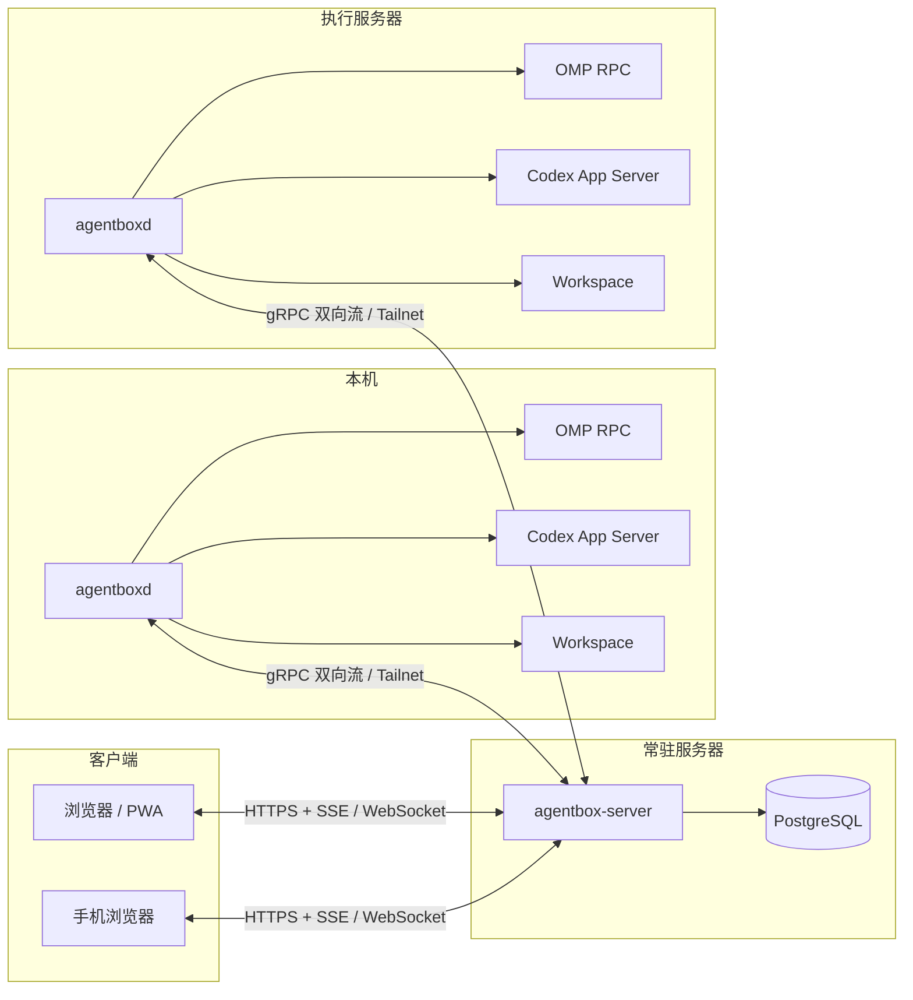
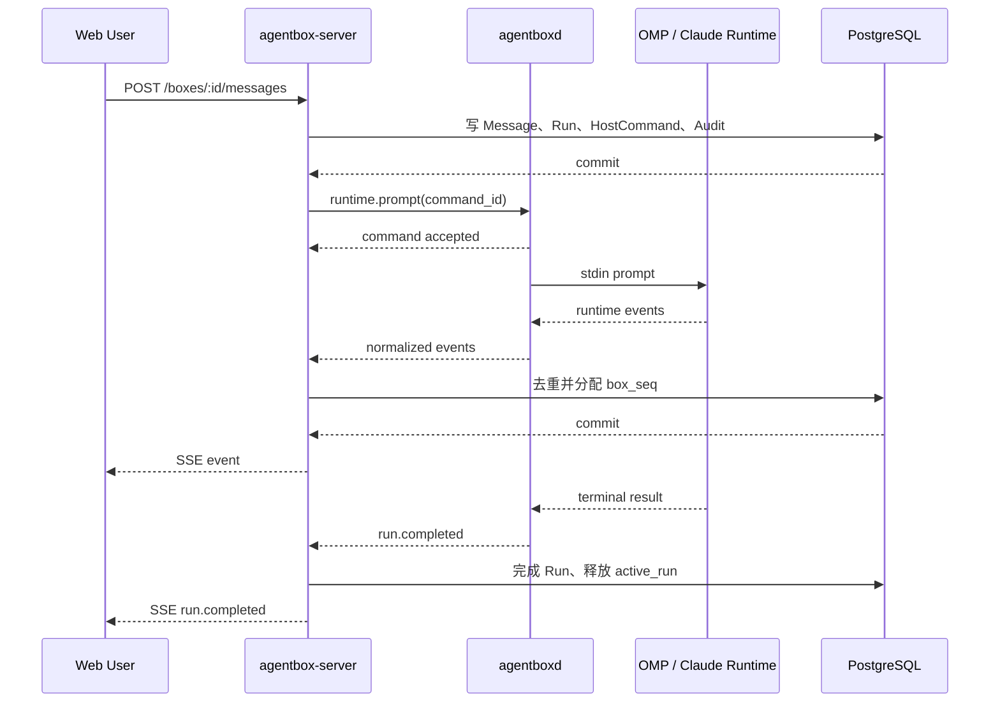
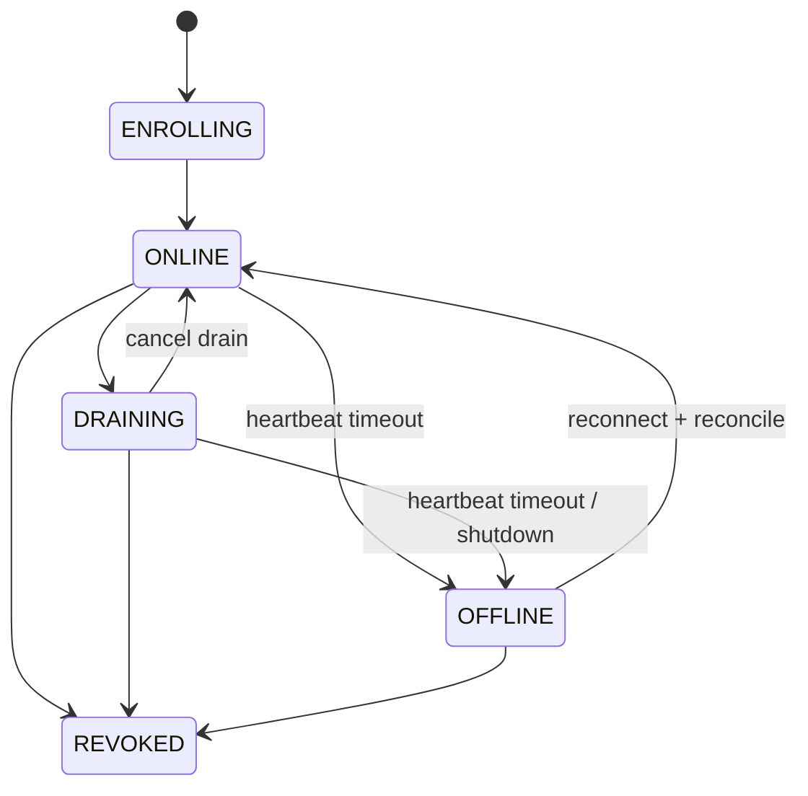
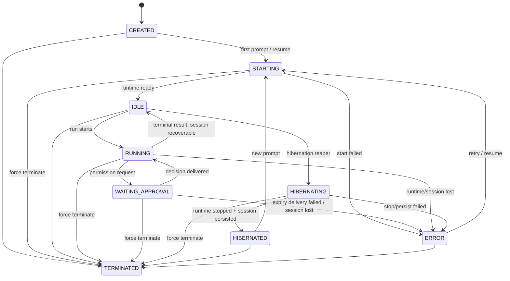
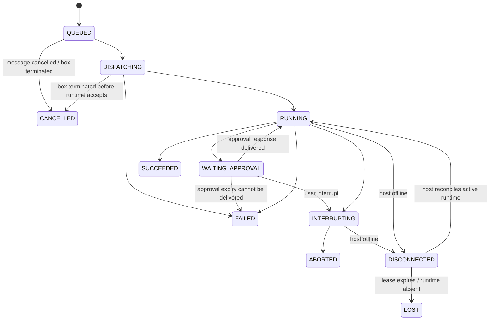

# Agent Box 技术设计方案

- 状态：Draft
- Agent Terminal 设计：[`agent-terminal-technical-design.md`](./agent-terminal-technical-design.md)
- 目标版本：MVP → Multi-user V1
- 核心组件：`agentbox-web`、`agentbox-server`、`agentboxd`
- 网络前提：所有客户端、Control Plane 与 Execution Host 位于同一 Tailscale Tailnet
- Runtime 范围：V1 开放 OMP、Codex；Claude Code Adapter 默认关闭；ACP 作为后续可插拔适配器

## 1. 结论摘要

系统按三个独立组件开发：

1. `agentbox-web`：React/PWA Web Console，只通过公开 API、SSE 和 WebSocket 访问 Control Plane。
2. `agentbox-server`：始终在线的多用户 Control Plane，持有权威状态、鉴权、RBAC、Box/Run 编排、事件存储与 Host 调度。
3. `agentboxd`：部署在每台执行机器上的守护进程，管理 Workspace、Runtime 子进程、Session、进程树与事件转发。

MVP 部署时，`agentbox-web` 构建为静态资源并嵌入 `agentbox-server`，因此运行时只有两个自研程序：

```text
agentbox-server
agentboxd
```

但代码、构建、测试和 API 边界保持独立。状态存储使用 PostgreSQL。OMP、Codex 与可选 Claude Code 都是 `agentboxd` 管理的外部 Runtime，不属于自研服务。

推荐的首版拓扑：



## 2. 目标与非目标

### 2.1 目标

MVP 必须支持：

- 多用户通过 Web/PWA 同时访问始终在线的 Console。
- 用户创建和版本化 Agent Definition。
- Agent Definition 配置不同的 System Prompt、Runtime、模型、Tools、Skills 和权限策略。
- 用户选择本机或服务器作为 Execution Host。
- 每个 Agent Box 持有独立的会话、Workspace、消息、事件和 Runtime 生命周期。
- 同一个 Box 支持持续多轮对话。
- 支持普通 Prompt、Steer、Follow-up、Interrupt、Stop 和 Resume。
- OMP 通过 `omp --mode rpc` 接入。
- Codex 通过官方 App Server stdio 协议接入；Claude Code stream-json Adapter 已实现但由 Feature Flag 默认关闭。
- 实时展示文本、工具调用、Todo、Subagent、审批和最终结果。
- 多个用户可以同时观察同一个 Box。
- 每个 Box 同一时间只允许一个活跃 Main Agent Turn。
- Host 断线、Server 重启、Runtime 崩溃后状态可解释、可恢复。
- 全链路 Audit Log、幂等、权限检查和 Workspace 路径约束。

### 2.2 非目标

MVP 不实现：

- 公网访问或匿名用户；网络边界由 Tailscale 提供。
- Kubernetes、容器编排、VM 编排或 UTM 管理。
- Box 在 Host 之间无缝迁移。
- 多地域高可用。
- 多 Control Plane 实例。
- Kafka、Service Mesh、分布式事务。
- 原生 iOS/Android App；先使用 PWA。
- 通用 Workflow DAG 引擎。
- 在同一个 Box 中并行运行多个 Main Agent Turn。
- 自研模型 Gateway 或模型计费系统。

### 2.3 设计原则

1. **Control Plane 不执行用户代码**：Shell、文件和 Runtime 进程只在 `agentboxd` 所在 Host 运行。
2. **Host 不做权限权威判断**：Control Plane 决定用户是否有权限；Host 对路径、命令和本地资源边界进行第二次强制校验。
3. **Box 是逻辑对象，不等同于 VM/Container**：Local、Docker、UTM、OpenSandbox 都可以成为未来 Execution Backend。
4. **Runtime 与 Execution Backend 正交**：OMP/Codex/Claude 是 Runtime；Local/Docker/VM 是执行环境。
5. **所有状态变化可审计**：用户命令、审批、进程状态、Runtime 事件都有持久记录。
6. **至少一次传输，幂等消费**：Control Plane 与 daemon 的网络重试不能导致重复 Prompt、重复审批或重复启动进程。
7. **持久状态优先于内存状态**：关键状态先落 PostgreSQL，再广播给前端。
8. **先做单体，保留边界**：`agentbox-server` 首版为模块化单体，不拆微服务。

## 3. 核心领域模型

### 3.1 Agent Definition

Agent Definition 是可复用、可版本化的配置模板，不对应常驻进程。

```json
{
  "id": "agent_backend_engineer",
  "version": 3,
  "name": "Backend Engineer",
  "runtime": "omp",
  "model": "cpa/gpt-5.6-sol",
  "thinkingLevel": "high",
  "appendSystemPrompt": "你是一名资深 Go 服务端工程师……",
  "skills": ["bytedance-codebase", "bytedance-apm"],
  "tools": ["read", "grep", "lsp", "edit", "bash"],
  "approvalPolicy": "write",
  "runtimeConfig": {}
}
```

Agent Definition 更新后产生新版本；已经存在的 Box 固定引用创建时的版本，避免角色和权限在运行中静默变化。

### 3.2 Execution Host

Execution Host 是运行 `agentboxd` 的机器。

```json
{
  "id": "host_home_mac",
  "name": "Home Mac",
  "status": "ONLINE",
  "os": "darwin",
  "arch": "arm64",
  "labels": {
    "location": "home",
    "trusted": "true"
  },
  "capabilities": {
    "runtimes": ["omp", "codex"],
    "maxActiveBoxes": 4
  }
}
```

### 3.3 Workspace

Workspace 是 Host 上受控的绝对路径。Control Plane 保存逻辑记录，真实路径由 Host 校验。

```json
{
  "id": "workspace_order_service",
  "hostId": "host_home_mac",
  "name": "order-service",
  "path": "/Users/example/projects/order-service",
  "allowedUsers": ["user_alice"]
}
```

Workspace 路径由 Owner/Admin 在 Web Console 新建 Box 时直接填写，不要求用户编辑 `agentboxd` 配置。daemon 默认把当前系统用户的 Home 目录作为安全边界，并在注册阶段执行验证：

1. 路径必须是绝对路径。
2. `realpath` 后必须存在且为目录。
3. `realpath` 后必须位于 daemon 系统用户 Home 内。
4. 路径不能位于 `~/.agentboxd/state` 内。

验证通过后 Workspace 才从 `provisioning` 进入 `ready`；Runtime 和 Terminal 始终使用 daemon 返回的真实目录作为 `cwd`。

### 3.4 Agent Box

Agent Box 是用户持续对话的长期对象。

```json
{
  "id": "box_123",
  "name": "Order Service Debug",
  "agentDefinitionId": "agent_backend_engineer",
  "agentDefinitionVersion": 3,
  "hostId": "host_home_mac",
  "workspaceId": "workspace_order_service",
  "status": "IDLE",
  "ownerId": "user_alice",
  "visibility": "private",
  "version": 12
}
```

### 3.5 Run / Turn

每次用户 Prompt 形成一个 Run。普通 Prompt、Steer 和 Follow-up 均持久化为 Message，但只有普通 Prompt/Follow-up 最终形成新的 Turn；Steer 作用于当前 Run。

```json
{
  "id": "run_456",
  "boxId": "box_123",
  "status": "RUNNING",
  "triggerMessageId": "message_789",
  "runtimeInstanceId": "runtime_abc",
  "startedAt": "...",
  "finishedAt": null
}
```

### 3.6 Runtime Instance

Runtime Instance 是 Host 上真实的 OMP、Codex 或可选 Claude 子进程。

```json
{
  "id": "runtime_abc",
  "boxId": "box_123",
  "hostId": "host_home_mac",
  "runtime": "omp",
  "pid": 12345,
  "status": "READY",
  "sessionRef": "...",
  "startedAt": "..."
}
```

Runtime 进程是临时对象；Box、Workspace、Session 和事件是长期对象。

## 4. 技术选型

| 领域 | 推荐技术 | 说明 |
|---|---|---|
| Web | React + TypeScript + Vite | PWA、成熟生态、静态部署 |
| Web 状态 | TanStack Query + 局部状态容器 | Server State 与 UI State 分离 |
| API Client | OpenAPI 生成 TypeScript Client | 避免散落手写 fetch |
| Control Plane | Go | 进程管理、并发、SSE、gRPC、低资源常驻 |
| HTTP Router | Go 标准库或轻量 Router | 不引入重量级框架约束 |
| Host Protocol | gRPC 双向流 + Protobuf | Go-to-Go、类型稳定、心跳与双向命令 |
| Web Event | SSE | 自动重连、Last-Event-ID、单向事件适配 |
| Terminal | WebSocket | 双向低延迟输入输出 |
| 数据库 | PostgreSQL 16+ | 多用户、事务、JSONB、可靠事件存储 |
| Migration | 版本化 SQL Migration | 禁止 ORM 自动改表 |
| Artifact | Host 文件系统；后续 S3/MinIO | MVP 避免对象存储依赖 |
| 日志 | 结构化 JSON | 统一 host/box/run/event 关联字段 |
| Metrics | Prometheus 格式 | 可接 Grafana，不强制 MVP 部署 |
| 网络 | Tailscale | 设备身份、加密、ACL、MagicDNS |

### 4.1 为什么不用 SQLite

个人单机 PoC 可以使用 SQLite，但目标已经明确为常驻、多用户 Console。PostgreSQL 能提供：

- 并发事务和行锁。
- `SKIP LOCKED` 队列消费。
- JSONB Event Payload。
- 唯一约束保证幂等。
- 后续多实例兼容。

因此设计直接以 PostgreSQL 为权威存储。

### 4.2 为什么首版不用 Redis/NATS

单 `agentbox-server` 实例内，Runtime Event 写入 PostgreSQL 后直接通过内存 Hub 广播。Redis/NATS 只有在多 Server 实例时才解决跨实例 Fanout，不应成为 MVP 前置依赖。

### 4.3 推荐仓库结构

三个组件位于同一个 Monorepo，但拥有独立入口、依赖边界和构建产物：

```text
agentbox/
├── apps/
│   ├── web/                 # agentbox-web: React/PWA
│   └── server/              # agentbox-server: Go Control Plane
├── cmd/
│   └── agentboxd/           # Host daemon 入口
├── internal/
│   ├── controlplane/
│   ├── daemon/
│   ├── runtime/
│   │   ├── omp/
│   │   ├── codex/
│   │   ├── claude/
│   │   └── acp/
│   ├── events/
│   ├── approvals/
│   ├── scheduler/
│   └── storage/
├── api/
│   ├── openapi.yaml
│   ├── host.proto
│   └── event.schema.json
├── packages/
│   └── api-client/          # OpenAPI 生成的 TypeScript Client
├── migrations/
└── docs/
```

依赖方向：

```text
agentbox-web → OpenAPI Client → agentbox-server
agentbox-server → domain/storage/host protocol
agentboxd → host protocol/runtime adapters
runtime adapters → 外部 OMP/Codex/Claude 进程
```

禁止 `agentbox-web` 复用 Server 内部数据库模型；Web 只依赖公开 API Schema。Server 与 daemon 共享的仅是 Protobuf/Event Schema，不共享带副作用的内部实现。

构建产物：

```text
dist/agentbox-web.tar.gz
dist/agentbox-server
dist/agentboxd
```

正式发布可以把 Web 静态资源嵌入 Server，但 Web 仍能独立运行开发服务器和 Contract Test。


## 5. `agentbox-web` 设计

### 5.1 职责

`agentbox-web` 只负责展示和用户交互：

- 用户身份与组织上下文。
- Agent Definition CRUD 与版本展示。
- Host 在线状态和能力展示。
- Workspace 选择。
- Box 创建、列表和详情。
- 多轮对话。
- Run 状态。
- Tool Timeline。
- Todo 与 Subagent Tree。
- Approval Card。
- Diff 与 Artifact。
- Terminal。
- Audit Log 查询。

它不直接访问数据库、Host、OMP、Codex 或 Claude。

### 5.2 页面结构

```text
/
├── /dashboard
├── /agents
│   ├── /new
│   └── /:agentId/versions/:version
├── /hosts
│   └── /:hostId
├── /workspaces
├── /boxes
│   └── /:boxId
│       ├── conversation
│       ├── timeline
│       ├── subagents
│       ├── changes
│       ├── artifacts
│       └── settings
├── /approvals
├── /schedules
└── /admin
    ├── users
    ├── teams
    ├── roles
    └── audit
```

### 5.3 Box 页面布局

```text
┌─────────────────────────────────────────────────────┐
│ Box Header: Host / Runtime / Status / Stop / Resume │
├──────────────┬──────────────────────┬───────────────┤
│ Conversation │ Tool & Subagent Tree │ Context Panel │
│              │                      │ Todo          │
│ Prompt Box   │                      │ Changes       │
└──────────────┴──────────────────────┴───────────────┘
```

移动端采用单列 Tab：Conversation、Activity、Changes、Info。

### 5.4 Web 数据流

1. HTTP 获取 Box Snapshot。
2. 使用 `GET /api/v1/boxes/:id/events` 建立 SSE。
3. 前端按 `seq` 严格应用事件。
4. 断线后通过 `Last-Event-ID` 恢复。
5. 发现序列缺口时重新拉 Snapshot，而不是猜测缺失状态。

### 5.5 Prompt 交互

Prompt Composer 必须让用户明确选择交付语义：

- `Prompt`：Box 空闲时立即执行；忙时进入队列。
- `Steer`：介入当前 Run。
- `Follow-up`：当前 Run 完成后执行。

Box 忙时默认按钮为 Follow-up，避免误把普通对话当成并行 Main Turn。

```json
{
  "content": "完成后再运行 race test",
  "delivery": "follow_up",
  "idempotencyKey": "01J..."
}
```

### 5.6 多用户协作

- 所有用户消息显示发送者。
- Presence 仅作为非权威 UI 状态。
- Approval 使用数据库原子更新，第一个有效决策生效。
- Stop/Interrupt/Terminate 幂等。
- Box Detail 显示操作权限，前端隐藏按钮只是体验优化，服务端必须重新鉴权。

### 5.7 前端可靠性

- SSE 事件按 `boxId + seq` 去重。
- 所有修改请求使用 `Idempotency-Key`。
- 关键资源更新使用 `If-Match`/Version 做乐观并发控制。
- 前端不缓存 Secret 原值。
- Terminal 与普通事件流分开，避免大量 PTY 字节阻塞 Agent Event。

## 6. `agentbox-server` 设计

### 6.1 模块化单体

```text
agentbox-server
├── auth
├── rbac
├── agents
├── hosts
├── workspaces
├── boxes
├── runs
├── messages
├── events
├── approvals
├── artifacts
├── scheduler
├── audit
├── hostgateway
└── storage
```

模块之间通过 Go 接口和数据库事务协作，不通过内部 HTTP 调用。

### 6.2 职责

- 本地账号密码、服务端 Session 与账号生命周期管理。
- Admin/User RBAC 和 Box/Workspace ACL。
- Agent Definition 版本管理。
- Host 注册、心跳、能力和 Drain。
- Workspace 元数据与授权。
- Box/Run 状态机。
- Prompt、Steer、Follow-up 和 Interrupt 路由。
- Runtime 命令持久化和派发。
- Runtime Event 接收、去重、排序、持久化和广播。
- Approval 生命周期。
- Cron/Webhook（V1）。
- Artifact 元数据。
- Audit Log。

### 6.3 身份认证

Control Plane 的 Web 身份认证完全由 AgentBox 本地账号负责：

1. 用户名全局唯一，密码使用 bcrypt cost 12 保存。
2. 成功登录后签发随机 256-bit Session Token，数据库仅保存 SHA-256 hash。
3. Session 使用服务端持久化的 `HttpOnly + SameSite=Strict` Cookie；Public URL 为 HTTPS 时设置 `Secure`。
4. Session 默认有效期 7 天，账号禁用、密码修改和管理员密码重置立即撤销相关 Session。
5. 登录按来源 IP + username 组合限速：15 分钟窗口内最多 5 次失败，达到阈值返回 `429` 与 `Retry-After`。

首次空库启动创建 `admin/admin123`，只写入 bcrypt hash，并标记 `must_change_password=true`。首次登录只能访问 Meta、Logout 和 Change Password；修改后才可进入业务 API。后续启动不得覆盖已存在 Admin 的密码。

Tailscale 只承担 Client、Control Plane 与 Host 之间的网络连通、设备认证和网络 ACL，不映射 AgentBox 用户，不注入角色，也不参与 Web Session 判定。

### 6.4 RBAC

组织账号角色：

- Admin：账号管理、Agent Definition、Host、Workspace、组织级配置以及所有资源操作。
- User：使用已授权或自己拥有的 Workspace、Box、Schedule、Approval、Terminal 和 Artifact。

系统禁止 Admin 修改自己的角色或禁用自己，并在事务内保证至少一个活跃 Admin。

资源级 ACL：

```text
box owner
box operator
box viewer
workspace owner
workspace operator
workspace viewer
```

MVP 不提供资源级 Host ACL；Host 管理仅由 Organization Owner/Admin 执行。需要细粒度 Host 授权时再增加 `host_acl`，不在中间件中使用不存在的 `host operator` 数据。

权限判断顺序：

1. 认证用户。
2. 组织角色。
3. 资源 ACL。
4. 资源状态约束。
5. Host 本地边界复核。

### 6.5 Host Gateway

`agentboxd` 主动建立 gRPC 双向流：

```text
agentboxd → agentbox-server: Host.Connect(stream HostFrame) returns (stream ServerFrame)
```

Control Plane 不主动拨号 Host，便于：

- Host 动态上下线。
- 简化 Tailnet ACL。
- 统一心跳和事件。
- 避免 Host 开放额外管理端口。

### 6.6 Runtime Command Outbox

Server 下发给 daemon 的命令必须先持久化：

```text
事务：
1. 更新 Box/Run 状态
2. 插入 host_commands
3. 写 Audit Log
4. commit
5. 异步通过 Host Stream 派发
```

`host_commands` 示例：

```json
{
  "commandId": "cmd_123",
  "hostId": "host_home_mac",
  "boxId": "box_123",
  "type": "runtime.prompt",
  "payload": {},
  "status": "PENDING",
  "attempt": 0
}
```

Host 重连后重新发送未完成命令。daemon 通过 `commandId` 做幂等去重。

### 6.7 Event Ingestion

Runtime Event 流程：

```text
Runtime
→ agentboxd 规范化
→ gRPC Host Stream
→ Server 去重
→ PostgreSQL 事务分配 box_seq
→ commit
→ SSE Hub 广播
```

服务端唯一约束：

```text
PRIMARY KEY(box_id, seq)
UNIQUE(event_id)
UNIQUE(host_id, daemon_event_id) WHERE daemon_event_id IS NOT NULL
CHECK(daemon_event_id IS NULL OR host_id IS NOT NULL)
```

先持久化、后广播。Server 崩溃时，客户端通过数据库补拉事件。

### 6.8 SSE

```http
GET /api/v1/boxes/:boxId/events
Accept: text/event-stream
Last-Event-ID: 1058
```

响应：

```text
id: 1059
event: tool.started
data: {"runId":"run_456","tool":"bash"}

id: 1060
event: text.delta
data: {"runId":"run_456","text":"正在检查..."}
```

要求：

- 15–30 秒 heartbeat comment。
- 支持从 `Last-Event-ID` 回放。
- 单次回放设置上限；超过上限返回 Snapshot Required。
- 慢消费者不能阻塞 Event Ingestion；缓冲区溢出时断开并要求重连。

### 6.9 Scheduler

Scheduler 首版作为 Server 内部模块：

- 使用 PostgreSQL 行锁领取到期 Schedule。
- 创建普通 Message/Run，不绕过权限和审计。
- 使用 `FOR UPDATE SKIP LOCKED` 保留未来多实例兼容。
- Cron Run 必须绑定明确 Agent、Host、Workspace 和权限策略。

### 6.10 Reconciliation Workers

Control Plane 内置两个数据库驱动的后台 Worker；它们是状态机的正式 Actor，不依赖单进程内存 Timer。

**Approval Reaper**：

1. 使用 `FOR UPDATE SKIP LOCKED` 领取 `status=pending AND expires_at<=now()` 的 Approval。
2. 原子更新为 `expired` 并写 Audit。
3. 按 Approval Policy 创建默认拒绝的 Host Command；默认策略是 `deny`，可配置为 `fail_run`。
4. Runtime 接受拒绝响应后，Run/Box 从 `waiting_approval` 回到 `running`，由 Runtime 决定继续或正常失败。
5. Runtime 已退出或拒绝无法送达时，Run=`failed`、Box=`error`，释放活跃 Run。

**Idle Hibernation Reaper**：

1. 领取 `status=idle` 且 `last_activity_at + idle_timeout <= now()` 的 Box。
2. CAS 更新 Box=`hibernating`，创建幂等 `runtime.stop` Command。
3. daemon 确认 Session 已持久化、Runtime 已退出后，Box=`hibernated`。
4. Stop 失败或 Host 断线时进入重试/`error`，不能静默标记 hibernated。

两个 Worker 都以数据库状态和唯一 Idempotency Key 为权威，Server 重启后可继续处理。

默认运行参数：Approval Reaper 每 1 秒扫描、每批最多 100 条；Idle Hibernation Reaper 每 30 秒扫描、每批最多 100 条。数据库错误使用 1–30 秒指数退避并记录 Metrics；配置可以覆盖，但不能关闭 Approval Reaper。

## 7. `agentboxd` 设计

### 7.1 职责

```text
agentboxd
├── enrollment
├── host heartbeat
├── workspace guard
├── runtime supervisor
├── process tree manager
├── session manager
├── runtime adapters
├── event journal
├── artifact collector
├── secret injector
└── resource monitor
```

### 7.2 Host 配置

```yaml
server: https://agentbox.tailnet.ts.net
hostName: home-mac
labels:
  location: home
runtime:
  omp:
    binary: /Users/example/.local/bin/omp
    maxProcesses: 4
limits:
  maxActiveBoxes: 8
  maxRunDuration: 2h
```

项目目录不在该配置中维护。Owner/Admin 在 Web Console 输入本地绝对路径，Server 下发 `workspace.validate` 命令；daemon 以当前系统用户 Home 为边界执行 `realpath` 校验并回报结果。

### 7.3 Enrollment

1. Admin 在 Control Plane 创建一次性 Enrollment Token。
2. daemon 通过受控网络连接 Server，并使用 Token 注册；Tailscale 只提供传输网络，不提供应用身份。
3. Server 创建 Host 记录并签发 Host Credential。
4. daemon 将 Credential 存储在系统 Keychain 或权限为 `0600` 的文件。
5. Token 立即失效。

Host Credential 必须支持轮换和吊销。

### 7.4 Workspace Guard

对每个命令：

- 将路径解析为绝对 `realpath`。
- 确认位于允许根目录。
- 拒绝符号链接逃逸。
- 拒绝访问 daemon 配置、Credential 和其他 Box 私有目录。
- Runtime cwd 固定到 Box Workspace。
- 额外目录必须在 Box 配置中显式列出。

### 7.5 Runtime Supervisor

Supervisor 管理完整进程树，而不是只记录主 PID：

- 启动独立 process group/session。
- 捕获 stdin/stdout/stderr。
- 记录启动参数的脱敏版本。
- Soft Interrupt。
- Graceful Stop。
- 超时后 SIGTERM。
- 再超时后 SIGKILL 整个进程组。
- 收集退出码、signal 和 stderr tail。

Runtime 生命周期：

```text
ABSENT
→ STARTING
→ READY
→ BUSY
→ READY
→ STOPPING
→ EXITED
```

### 7.6 Local Journal

网络断开时 daemon 仍需保存事件和命令结果。每个 Runtime Instance 使用本地 append-only journal：

```text
~/.agentboxd/state/
└── boxes/box_123/
    ├── runtime.json
    ├── command-journal.jsonl
    └── event-journal.jsonl
```

重连后从最后已确认的 daemon event offset 继续上传。

### 7.7 Command 幂等

`agentboxd` 持久记录已执行 `commandId`：

- 重复 `runtime.start` 返回原 Runtime Instance。
- 重复 `runtime.prompt` 不再次发送 Prompt。
- 重复 `runtime.interrupt` 返回当前状态。
- 重复 `runtime.stop` 保证 Runtime 已停止。

Server Ack 不能作为命令完成；daemon 必须返回 Accepted、Started、Completed/Failed 阶段。

## 8. Runtime Adapter 设计

### 8.1 统一接口

```go
type RuntimeAdapter interface {
    Name() string
    Capabilities(ctx context.Context) RuntimeCapabilities
    Start(ctx context.Context, spec StartSpec) (RuntimeHandle, error)
    Send(ctx context.Context, handle RuntimeHandle, input RuntimeInput) error
    Interrupt(ctx context.Context, handle RuntimeHandle) error
    Stop(ctx context.Context, handle RuntimeHandle, mode StopMode) error
    Events(handle RuntimeHandle) <-chan RuntimeEvent
    Inspect(ctx context.Context, handle RuntimeHandle) (RuntimeState, error)
}
```

Capabilities 示例：

```json
{
  "steer": true,
  "followUp": true,
  "subagentEvents": true,
  "todoEvents": true,
  "resume": true,
  "hostTools": true,
  "interactiveApproval": true
}
```

Control Plane 和 Web 根据 Capabilities 显示功能，不通过 Runtime 名称硬编码。

### 8.2 OMP Adapter

启动：

```bash
omp --mode rpc \
  --cwd <workspace> \
  --approval-mode <mode> \
  --append-system-prompt <file>
```

核心协议：

- 等待 `ready`。
- 协商 RPC v2。
- 处理 `rpc_chunk` 重组。
- `prompt` ack 不代表 Run 完成。
- 以 terminal `agent_end` 作为 Turn 完成。
- 映射 `message_update`、`tool_execution_*`、Todo、Subagent 和 Notice。
- 支持 `steer`、`follow_up`、`abort`。
- 启用 `set_subagent_subscription`，默认 `progress`，按 UI 请求拉完整 transcript。

### 8.3 Codex Adapter

启动：

```bash
codex app-server --listen stdio://
```

实现要求：

- 使用 Codex App Server 官方 JSON-RPC/JSONL 协议，不抓取 TUI 文本。
- 完成 `initialize` 后，通过 `thread/start` 或 `thread/resume` 建立长期 Thread。
- 每个用户回合通过 `turn/start` 发送，按 Thread/Turn notification 映射文本、工具和终态事件。
- Interrupt 使用 App Server 协议能力；Stop 负责结束子进程树。
- 持久化 Thread ID 作为 `sessionRef`，daemon/Runtime 重启后恢复多轮上下文。
- 只声明实测支持的 Capabilities；不把 Codex 不支持的 OMP Steer/Follow-up/Approval 伪装为可用。
- 模型为空时沿用 Host `~/.codex/config.toml` 默认值；模型非空时由 Agent Definition 显式传入。

### 8.4 Claude Adapter

Go daemon 直接管理 Claude CLI 的 stream-json 协议，避免新增 Python/Node 常驻 Sidecar：

```bash
claude -p \
  --input-format stream-json \
  --output-format stream-json \
  --verbose \
  --include-partial-messages \
  --replay-user-messages \
  --forward-subagent-text \
  --session-id <uuid> \
  --append-system-prompt-file <file>
```

实现要求：

- 解析 `system/init`，记录 Claude Code 版本和 capabilities。
- 每个 Turn 等待 `result` 消息结束。
- 使用 `parent_tool_use_id` 构建 Subagent 树。
- 处理中断后的残留消息，不能把前一 Turn 的 Result 误判为新 Turn。
- 持久化 Claude Session ID，Runtime 重启时使用 resume。
- System Prompt Snapshot 默认固定；Agent Definition 升级需要新建 Session。
- 通过 conformance fixtures 覆盖多个 Claude Code 版本。

### 8.5 Interactive Approval Bridge

Runtime 的权限请求必须映射为统一 `approval.requested` 事件，并在用户决策后回传 Runtime；不得因为 Adapter 无法处理交互式审批而静默自动批准。

OMP 路径：

- 使用 RPC Extension UI/Permission 事件接收请求。
- Control Plane 生成 Approval 记录。
- Web 决策经 Server、daemon 回传对应 RPC response。

Claude 路径是 Phase 0 的硬性验证项：

- 首选实现并验证 stream-json control/permission 消息。
- 如果当前 Claude CLI 的裸 stream-json 不能稳定承载审批回调，则使用官方 Claude Agent SDK Sidecar，或配置专用 Permission Prompt Tool。
- 在审批桥接验证完成前，Claude 集成阶段只能使用明确的静态 Permission Policy；不能宣称支持 Remote Approval。

Approval Request 必须包含稳定 request ID、Tool 名称、脱敏参数、风险等级、过期时间和默认拒绝策略。Runtime 进程退出、Run 中止或 Approval 过期后，迟到的用户决策返回冲突，不再传给 Runtime。

### 8.5 ACP Adapter

ACP 不进入 MVP，但统一接口必须容纳：

- JSON-RPC stdio。
- Initialize/Session/Prompt 生命周期。
- 标准 Tool、Permission 和 Event。

ACP 适合第三方 Agent；OMP/Claude 使用原生 Adapter 保留完整能力。

## 9. 跨组件协议

### 9.1 正常 Prompt 时序



HTTP 成功响应只表示 Message 和 Command 已持久化，不表示 Runtime 已接收或 Run 已完成。前端以 SSE 中的 `run.started`、`run.completed`/`run.failed` 为权威执行状态。


### 9.2 Web API

基础路径：`/api/v1`。

主要 API：

```text
POST   /agents
GET    /agents
GET    /agents/:id
POST   /agents/:id/versions

GET    /hosts
GET    /hosts/:id
POST   /hosts/:id/drain

POST   /workspaces
GET    /workspaces

POST   /boxes
GET    /boxes
GET    /boxes/:id
POST   /boxes/:id/messages
POST   /boxes/:id/interrupt
POST   /boxes/:id/stop
POST   /boxes/:id/resume
POST   /boxes/:id/terminate
GET    /boxes/:id/messages
GET    /boxes/:id/events
GET    /boxes/:id/subagents

GET    /approvals
POST   /approvals/:id/decision

GET    /audit-logs
```

### 9.3 Host Protocol

Protobuf Envelope：

```protobuf
message HostFrame {
  string frame_id = 1;
  uint64 host_seq = 2;
  oneof payload {
    HostHello hello = 10;
    Heartbeat heartbeat = 11;
    CommandAck command_ack = 12;
    RuntimeEvent runtime_event = 13;
    RuntimeSnapshot runtime_snapshot = 14;
    ArtifactReady artifact_ready = 15;
  }
}

message ServerFrame {
  string frame_id = 1;
  oneof payload {
    Welcome welcome = 10;
    HostCommand command = 11;
    EventAck event_ack = 12;
    ConfigUpdate config_update = 13;
    Ping ping = 14;
  }
}
```

规则：

- 每个 HostFrame 有唯一 `frame_id`。
- Runtime Event 另有稳定 `daemon_event_id`。
- Server Ack 包含已持久化的最大连续 Host/Event offset。
- 断线后 daemon 从 Ack offset 重传。
- 大 Artifact 不走 gRPC 流；Server 返回上传 URL 或由 daemon 提供受控下载。

- `host_seq` 的 Ack 进度按 `daemon_instance_id` 持久化到 Host；Server 重启后从数据库返回 `last_acked_host_seq`。
- daemon 每次进程启动生成新的 `daemon_instance_id`；实例变化时 Server 先 Reconcile Runtime Snapshot，再为新实例重置连续 Ack 窗口。
- CommandAck、Heartbeat、RuntimeSnapshot 等非 Runtime Event Frame 也必须按 `frame_id` 幂等处理，不能只依赖 `daemon_event_id`。

### 9.4 标准 Agent Event

```json
{
  "eventId": "evt_123",
  "boxId": "box_123",
  "runId": "run_456",
  "runtimeInstanceId": "runtime_abc",
  "type": "tool.started",
  "timestamp": "...",
  "actor": {
    "kind": "main_agent",
    "id": "main"
  },
  "payload": {}
}
```

事件类型：

```text
runtime.starting
runtime.ready
runtime.exited
run.started
run.completed
run.failed
message.started
message.delta
message.completed
tool.started
tool.progress
tool.completed
tool.failed
subagent.started
subagent.progress
subagent.completed
todo.updated
approval.requested
approval.resolved
artifact.created
notice
```

保留 `raw_runtime_event` 仅用于诊断，不直接暴露给普通前端。

## 10. 状态机

### 10.1 Host



### 10.2 Box



### 10.3 Run



### 10.4 Run 终态到 Box 状态映射

| Run 终态 | Session/Runtime 状态 | Box 目标状态 |
|---|---|---|
| `succeeded` | Session 可恢复 | `idle` |
| `failed` | Session 可恢复 | `idle` |
| `failed` | Runtime 或 Session 丢失 | `error` |
| `aborted` | Interrupt 已确认，Session 可恢复 | `idle` |
| `aborted` | 强杀导致 Session 不确定 | `error` |
| `lost` | Host 租约过期或 Runtime 不存在 | `error` |
| `cancelled` | Run 尚未启动 | Box 保持原状态；若 Box 正在终止则 `terminated` |

terminal Event Ingestion 必须在同一数据库事务内更新 Run 和 Box，禁止由不同异步消费者分别推导。

## 11. 并发与消息语义

### 11.1 单 Box 单 Main Turn

数据库保证同一 Box 最多一个活跃 Run：

- 使用部分唯一索引或事务行锁。
- 新普通 Prompt 在 Box 忙时进入 Message Queue。
- Steer 只允许存在 Active Run 时发送。
- Follow-up 始终排在当前 Run 之后。

### 11.2 多人并发

每条用户命令包含：

- `author_id`
- `idempotency_key`
- `box_version`
- `delivery`
- `created_at`

冲突规则：

- Prompt 顺序由 Server 接收并成功提交事务的顺序决定。
- Approval 第一个原子更新成功者胜出，后续返回 409。
- Terminate 优先级最高；已进入 TERMINATED 的 Box 拒绝新命令。
- Interrupt 幂等。
- UI Presence 不参与排序和权限判断。

### 11.3 Subagent 并行

Subagent 在同一个 Runtime 内部并行，Control Plane 只观测和展示，不单独创建 RPC 进程。Main Agent 仍负责汇总。

## 12. 数据模型

开发级 ERD、字段类型、外键、唯一约束、索引、事务边界、Migration 顺序和 Repository 接口以独立文档为权威：

- [`agent-box-erd.md`](./agent-box-erd.md)

核心关系：

```text
Organization
├── User / Team / Membership
├── Agent
│   └── immutable Agent Version
├── Host
│   ├── Runtime Capability
│   └── Workspace Root
├── Workspace
│   └── Workspace ACL
├── Box
│   ├── Box ACL
│   ├── Runtime Instance
│   ├── Run
│   ├── Message
│   ├── Event
│   ├── Approval
│   ├── Subagent/Todo Projection
│   └── Artifact
├── Schedule
├── Secret Reference
└── Audit Log
```

数据库实现必须遵守：

- PostgreSQL 16+，UUIDv7 由应用生成。
- 所有租户实体带 `organization_id`，跨实体引用使用复合租户外键。
- Agent Version 发布后不可修改；Box 固定引用具体 Version。
- 每个 Box 最多一个活跃 Main Run、一个活跃 Runtime Instance，由部分唯一索引保证。
- Message、Host Command、Daemon Event 和 Schedule Tick 都有数据库幂等约束。
- Box Event 使用 `(box_id, seq)` 连续排序，先持久化再 SSE 广播。
- Approval 使用 pending Compare-And-Set，第一个有效决策胜出。
- Workspace/Box ACL 使用显式 User/Team FK，不使用无约束 polymorphic subject ID。
- Secret 原值不进入普通业务表、Event、Audit 或日志。

ERD 文档验收通过后，表结构变更必须先修改 ERD 和 Migration，再修改代码；禁止实现与文档各自演化。

## 13. 安全设计

### 13.1 信任边界

```text
Browser：不可信输入
Control Plane：权限权威
agentboxd：执行边界
Runtime：可能执行不可信模型生成内容
Workspace：受控但可被 Runtime 修改
```

### 13.2 网络

- Web、Server、Host 仅通过 Tailnet 通信。
- 禁止 Tailscale Funnel。
- Tailnet ACL：Client 只能访问 Server；Server 可以访问/接收 Host 通道；Client 不能直连 daemon 管理接口。
- Server 和 daemon 仍执行应用层认证，不把 Tailscale 当成唯一授权层。

### 13.3 Prompt Injection 与工具权限

- Agent Definition 明确 Tool Allowlist。
- 读取外部内容不能自动提升工具权限。
- 高风险操作生成 Approval。
- Runtime Adapter 不允许模型修改 daemon 配置和 Host Credential。
- Bash 命令、路径和网络访问策略由 Runtime 原生权限与 daemon 边界共同执行。

### 13.4 Secret

MVP 原则：

- Server 只保存 Secret 元数据或加密值。
- 前端不能读回原值。
- daemon 按 Box/Run 注入最小范围环境变量。
- 日志、Event 和 Audit 自动脱敏。
- Runtime 退出后清理临时 Secret 文件和环境。

V1 再接入 Vault/KMS；MVP 可使用 Server 主密钥加密，但必须支持轮换设计。

### 13.5 Audit

以下操作必须审计：

- 用户登录、Host Enrollment、Credential 轮换。
- Agent Definition 修改。
- Box 创建、停止、恢复、终止。
- Prompt、Steer、Follow-up、Interrupt。
- Approval 决策。
- Secret 配置和引用。
- Host Drain/Revoke。
- Workspace 授权变更。

Audit Log append-only，普通用户不可修改。

## 14. 故障处理与恢复

### 14.1 Web 断线

- Runtime 继续。
- Event 已持久化。
- 重连后使用 `Last-Event-ID` 回放。

### 14.2 Server 重启

- PostgreSQL 保留所有权威状态和未完成 Host Command。
- daemon 自动重连并发送 Runtime Snapshot。
- Server Reconcile：对比 DB 与 Host Snapshot，恢复 ONLINE/RUNNING 或标记 LOST。

### 14.3 Host 断线

- 心跳超时后 Host=OFFLINE。
- Run=DISCONNECTED，不立即判失败。
- 新 Prompt 可排队但不下发。
- Host 重连后恢复事件上传和 Command Ack。
- 超过配置租约后 Run=LOST，等待用户 Retry/Resume。

### 14.4 Runtime 崩溃

- daemon 收集 exit code、signal、stderr tail。
- 发出 `runtime.exited` 和 `run.failed`。
- 不自动无限重启。
- Box 进入 ERROR 或 IDLE，取决于 Session 是否可恢复。
- 用户可选择 Resume 或创建新 Session。

### 14.5 数据库不可用

- Server 停止接受新的状态修改。
- 不向前端广播未持久化 Runtime Event。
- daemon 本地 Journal 缓冲事件。
- 数据库恢复后 daemon 重传。

### 14.6 Event 重复与乱序

- daemon event ID 去重。
- Server 为每个 Box 分配权威连续 seq。
- 前端只按 seq 应用。
- Host 原始事件顺序通过 Runtime-local sequence 验证；缺口触发重传或 Snapshot。

### 14.7 Approval 与 Hibernation 超时恢复

- Approval 到期由 Approval Reaper 主动处理，不能只依赖用户迟到请求触发状态变化。
- Pending Approval 所在 Run 被 Interrupt/Terminate 时，Approval 先原子更新为 `cancelled`，再下发 Runtime Interrupt。
- Hibernation 到期由 Idle Hibernation Reaper 创建幂等 Stop Command；没有 daemon 完成确认时不能把 Box 标为 `hibernated`。
- Reaper 使用数据库锁和 Idempotency Key，Server 重启或多实例并发执行不会产生重复拒绝或重复 Stop。

## 15. 部署设计

### 15.1 MVP 单点部署

常驻服务器：

```text
agentbox-server
PostgreSQL
Tailscale
```

`agentbox-server` 绑定 loopback，由 Tailscale Serve 暴露：

```text
https://agentbox.<tailnet>.ts.net
```

Host：

```text
agentboxd
OMP
Claude Code
Tailscale
```

### 15.2 Web 与 Server 发布

开发时独立：

```text
apps/web
apps/server
```

构建时：

1. Web 生成 `dist/`。
2. Server 使用 Go embed 打包静态文件。
3. `/api/*`、`/events/*`、`/ws/*` 由后端处理。
4. 其他路径返回 SPA。

同源部署避免 CORS 和跨域 Cookie 问题。

### 15.3 daemon 服务管理

macOS 使用 LaunchAgent，Linux 使用 systemd：

- 开机启动。
- 崩溃重启带退避。
- 日志进入统一文件或系统日志。
- 升级时先 Drain，等待 Runtime 结束或显式迁移/停止。

### 15.4 未来高可用

只有在明确需要时引入：

- 多 `agentbox-server` 实例。
- Redis Streams/NATS 作为跨实例 Fanout。
- PostgreSQL HA。
- Artifact Object Storage。
- gRPC Host Stream 粘性路由或独立 Host Gateway。

## 16. 可观测性

### 16.1 日志字段

所有日志至少包含：

```text
component
host_id
box_id
run_id
runtime_instance_id
command_id
event_id
user_id
request_id
```

禁止记录 Prompt 全文、Secret 和未脱敏工具参数到普通运行日志；这些内容只进入有权限控制的业务数据表。

### 16.2 Metrics

Control Plane：

```text
http_requests_total
http_request_duration_seconds
sse_connections
host_connections
host_offline_total
runs_started_total
runs_completed_total
runs_failed_total
run_duration_seconds
commands_pending
commands_retry_total
event_ingest_lag_seconds
event_broadcast_dropped_total
approval_pending
```

daemon：

```text
runtime_processes
runtime_start_duration_seconds
runtime_exit_total
runtime_event_backlog
server_connection_up
server_reconnect_total
workspace_validation_failed_total
process_kill_escalation_total
```

### 16.3 告警

- Control Plane 不可访问。
- PostgreSQL 不可访问。
- Host 大面积离线。
- Event backlog 持续增长。
- Run 长时间无事件。
- Runtime 启动失败率突增。
- Approval 长时间未处理。
- Disk usage 超阈值。

## 17. 测试策略

### 17.1 单元测试

- 状态机合法迁移。
- RBAC 矩阵。
- Workspace 路径逃逸。
- Idempotency。
- Runtime Event 映射。
- Command Ack/Retry。
- Secret 脱敏。

### 17.2 Contract Test

- OpenAPI Schema 与生成 Client。
- Protobuf 向后兼容。
- 标准 Agent Event JSON Schema。
- SSE 回放和序列连续性。

### 17.3 Runtime Conformance

为 OMP/Claude 保存脱敏 JSONL fixtures：

- 初始化。
- 普通 Prompt。
- Tool Call。
- 多轮。
- Interrupt。
- Subagent。
- 崩溃。
- 大消息分片。
- Resume。

每次 Runtime 版本升级先跑 fixtures 和真实 smoke test。

### 17.4 集成测试

使用 Fake Runtime Adapter：

- 可控延迟。
- 可产生 Tool/Subagent/Todo。
- 可模拟断线、重复事件和崩溃。

端到端：

```text
Web/API 创建 Box
→ Fake daemon 注册
→ Runtime 启动
→ Prompt
→ SSE 收到完整事件
→ Run 完成
→ 断线重连回放
```

### 17.5 故障注入

- Prompt 发送后 Server 崩溃。
- Event 持久化前 daemon 重连。
- Runtime 输出半条 JSON 后退出。
- Host 断网后产生 10,000 条事件。
- 两个用户同时审批。
- 同一 Idempotency Key 重试。
- PostgreSQL 短暂不可用。

## 18. 开发阶段

### Phase 0：协议验证

- OMP RPC Go Client Spike。
- Claude stream-json Go Client Spike。
- 标准 Event 映射。
- Interrupt/Resume/Subagent Smoke Test。
- 确认真实协议边界后冻结 Runtime Adapter 接口。

验收：两个 Runtime 都能完成连续两轮对话、工具调用和中止。

### Phase 1：单用户端到端

- agentbox-server 基础 API。
- agentboxd 注册和单 Host。
- Agent/Workspace/Box。
- OMP Adapter。
- 对话 Web UI。
- PostgreSQL Event Store。
- SSE。
- Stop/Resume。

验收：手机通过 Tailnet 创建 Box 并持续操作本机 OMP。

### Phase 2：Claude 与多用户

- Claude Adapter。
- Tailscale Identity。
- User/Team/RBAC。
- Box ACL。
- Audit Log。
- 多用户同时观察。
- Prompt/Follow-up/Steer 协作语义。

验收：两个用户按权限协作同一个 Box，不产生重复 Run。

### Phase 3：审批与自动化

- Approval。
- Cron/Webhook。
- Notification。
- Artifact。
- Diff。
- Subagent Tree。
- Todo 展示。

### Phase 4：生产强化

- Secret Manager。
- Host Drain/Upgrade。
- Resource Limit。
- Redis/NATS（仅多实例需要）。
- Artifact Object Storage。
- 可选 Docker/UTM/OpenSandbox Backend。

## 19. 主要风险与缓解

| 风险 | 影响 | 缓解 |
|---|---|---|
| OMP/Claude 私有协议变化 | Adapter 失效 | Capabilities、版本探测、Fixtures、兼容层 |
| Runtime 在宿主执行危险命令 | 主机损坏/数据泄露 | Tool Policy、Approval、Workspace Root、未来 Sandbox |
| Host 断线时事件丢失 | UI 与真实状态不一致 | daemon 本地 Journal、Ack/重传 |
| 多用户重复操作 | 重复 Prompt/Approval | Idempotency Key、行锁、Version |
| Server 内存事件丢失 | 前端事件缺口 | 先 DB 后广播、SSE 回放 |
| Session 与 Agent Definition 漂移 | Agent 行为不可复现 | Box 固定 Agent Version/System Prompt Snapshot |
| 长任务占满 Host | 容量耗尽 | Host Capacity、Run Timeout、Drain |
| Secret 出现在事件和日志 | 凭证泄露 | 注入最小化、统一脱敏、禁止前端读回 |
| 网络可达被误当成应用权限 | 越权 | Web 账号与 Admin/User RBAC 独立校验，Tailscale ACL 只限制网络可达性 |

## 20. 产品决策默认值

为达到可开发状态，ERD 已冻结以下默认值；这些是实现顺序或策略配置，不阻塞 Schema 与 Phase 0/1 开发：

1. **Runtime 顺序**：Phase 1 先完成 OMP，Schema 同时兼容 Claude/ACP；Phase 2 接入 Claude。
2. **Agent Definition 权限**：MVP 仅 Owner/Admin 可创建和发布；普通用户可使用已发布 Agent。
3. **Host Enrollment**：仅 Owner/Admin 可签发一次性 Enrollment Token。
4. **Approval 范围**：统一承接 Runtime 发出的所有交互式权限请求；Claude Approval Bridge 未验证前使用显式静态 Permission Policy，不虚假提供远程审批。
5. **Workspace**：MVP 优先引用 Host 既有路径，同时保留 managed/worktree 类型。
6. **空闲 TTL**：默认 30 分钟，可由 Agent Version 或 Box 覆盖，最小 60 秒、最大 7 天。
7. **保留周期**：Message/Event 默认 90 天，Audit 默认 365 天；组织级配置后续开放。
8. **共享策略**：Box 默认 private，只通过显式 User/Team ACL 分享；不默认全 Team 可见。
9. **Secret MVP**：只保存 `host_env`/外部 Secret 引用，不在 Control Plane 保存原值。
10. **Claude 认证**：Credential 属于 Execution Host 的 Runtime 配置，不进入 Box Schema；支持方式由 Host Policy 决定。

具体字段、约束和事务以 [`agent-box-erd.md`](./agent-box-erd.md) 为准。

## 21. MVP 完成标准

MVP 只有同时满足以下条件才算完成：

- Web、Server、daemon 三个组件可独立构建和测试。
- Web 静态资源可嵌入 Server 单点部署。
- 至少两台 Host 可通过 Tailnet 注册。
- 用户可选择 Host、Workspace 和 Agent 创建 Box。
- OMP Runtime 可连续完成至少两轮 Prompt。
- Box 忙时 Follow-up 正确排队。
- Interrupt 能终止当前 Turn 而不破坏 Session。
- 浏览器断线后 Agent 继续运行，重连能回放事件。
- Server 重启后 daemon 重连并恢复 Runtime Snapshot。
- 重复 HTTP 请求不会产生重复 Prompt。
- 两个用户可以同时观察同一个 Box。
- Viewer 无法发送 Prompt 或审批。
- Workspace 路径逃逸被 daemon 拒绝。
- 所有关键操作进入 Audit Log。
- Runtime 和 Server 日志不包含 Secret。
- 真实 OMP smoke test 通过；Claude stream-json Spike 通过并形成可复用 Conformance Fixtures。
